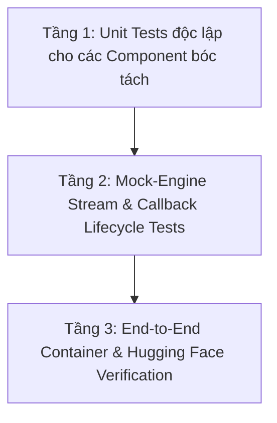

# Kế Hoạch Kiểm Thử & Xác Minh Tái Cấu Trúc Module AI
*(Test & Verification Plan for taskpilot-ai)*

Tài liệu này xác định bộ quy chuẩn kiểm thử và tiêu chí nghiệm thu (Acceptance Criteria) bắt buộc phải đạt được trong quá trình refactor `AiStreamingService.java` và module AI.

---

## 🎯 Chiến Lược Kiểm Thử 3 Tầng (3-Tier Testing Strategy)



---

## 📋 Danh Mục Kiểm Thử Chi Tiết (Test Catalog)

### 1. Tầng 1: Unit Tests Cho Các Component Bóc Tách

Mỗi class sau khi được bóc tách ra khỏi `AiStreamingService` phải có một class test tương ứng với độ bao phủ (coverage) các trường hợp biên:

#### A. `ChatMessageSanitizerTest.java`
- [ ] **Think Tag Stripping**: Kiểm tra bóc tách `<think>...</think>` ở đầu câu, giữa câu, và cuối câu.
- [ ] **Think Extraction**: Đảm bảo chuỗi suy nghĩ bên trong `<think>` được trích xuất nguyên vẹn phục vụ logging và debug.
- [ ] **Role Alternation**: Kiểm tra trường hợp 2 UserMessage hoặc 2 AiMessage liên tiếp được gộp (`mergeMessages`) thành công, tuân thủ yêu cầu khắt khe của Gemini API.
- [ ] **Tool Call Sanitization**: Kiểm tra làm phẳng (`flatten`) các tool call trong AiMessage thành text khi chuyển đổi sang Semantic Memory.

#### B. `ChatHistoryCompactorTest.java`
- [ ] **Token Estimation**: Xác minh hàm tính token xấp xỉ (`~4 chars / token`) cho cả tiếng Việt và tiếng Anh.
- [ ] **Window Pruning**: Khi context vượt quá `memory-max-tokens` (7,000 tokens), kiểm tra giữ lại đúng `contextTailMessages` (6 tin nhắn gần nhất).
- [ ] **Summary Generation**: Bản tóm tắt các tin nhắn cũ được đóng gói đúng định dạng `[Summary of earlier conversation: ...]`.

#### C. `ConfirmationBlockParserTest.java`
- [ ] **Human-in-the-Loop Detection**: Bắt đúng payload chứa `confirmationRequired: true` từ tool output.
- [ ] **Form Schema Generation**: Sinh đúng khối `taskpilot-form` khi thiếu các trường dữ liệu bắt buộc (title, description, assignee, v.v.).
- [ ] **Duplicate Block Prevention**: Đảm bảo không gắn lặp 2 khối xác nhận giống nhau trong cùng một lượt phản hồi (`confirmationBlockKey`).

#### D. `AiSseTransportTest.java`
- [ ] **Safe Send**: Gửi event thành công qua `SseEmitter`.
- [ ] **Client Disconnect Handling**: Khi client đóng tab / ngắt kết nối (`ClientAbortException`), emitter bắt lỗi êm xuôi, set flag `clientDisconnected = true`, không throw uncaught exception.
- [ ] **Safe Complete**: Đảm bảo `emitter.complete()` chỉ được gọi duy nhất 1 lần (dùng `AtomicBoolean`).

#### E. `SystemPromptBuilderTest.java`
- [ ] **User Context Injection**: Tên, email, role của user được nhúng chính xác vào template.
- [ ] **Step Estimation**: Nhận diện đúng câu lệnh đơn giản (`isSimpleAction`) vs câu lệnh phức tạp yêu cầu parallel chains (`smartQuery`).

---

### 2. Tầng 2: Kiểm Thử Vòng Đời Streaming & Failover (Engine Tests)

#### A. `StreamingChatEngineTest.java`
- [ ] **Multi-Key Rotation**: Khi Key 1 bị lỗi hạn mức (HTTP 429 Quota Exceeded), engine tự động chuyển sang Key 2 và thử lại mà không ngắt stream.
- [ ] **Tool Round Limit**: Đảm bảo số vòng lặp tool không vượt quá `MAX_TOOL_ROUNDS` (4 vòng).
- [ ] **Infinite Loop Breaker**: Nếu một tool bị gọi lặp lại liên tiếp quá 3 lần với cùng tham số (`advanceToolLoopState`), engine tự động ngắt và yêu cầu mô hình tổng hợp text.

#### B. `TimeoutFallbackHandlerTest.java`
- [ ] **First Token Timeout**: Nếu sau 60 giây không nhận được token đầu tiên từ LLM, engine kích hoạt fallback sang phản hồi text-only thông báo sự cố mạng.

---

### 3. Tầng 3: Kiểm Thử Triển Khai & Không Thoái Lui (Regression Gate)

Trước khi coi việc refactor là hoàn tất, toàn bộ hệ thống phải vượt qua:

1. **Clean Compile**:
   ```bash
   ./mvnw clean compile -B
   ```
2. **Unit & Module Tests**:
   ```bash
   ./mvnw test -pl taskpilot-ai -B
   ```
3. **Mô Phỏng Hugging Face Spaces**:
   ```bash
   bash taskpilot/scripts/verify-hf-deploy.sh
   ```
   *Yêu cầu*: Docker container khởi động dưới `UID 1000:1000` trên cổng `7860` và pass kiểm tra sức khỏe mà không có lỗi.
