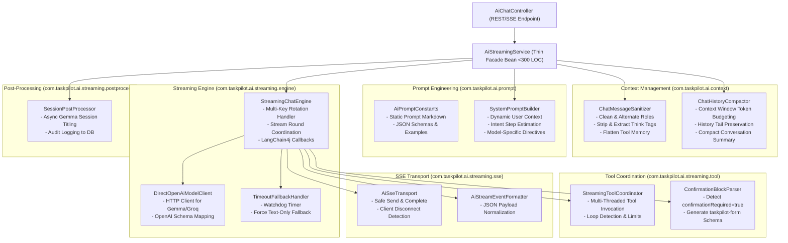
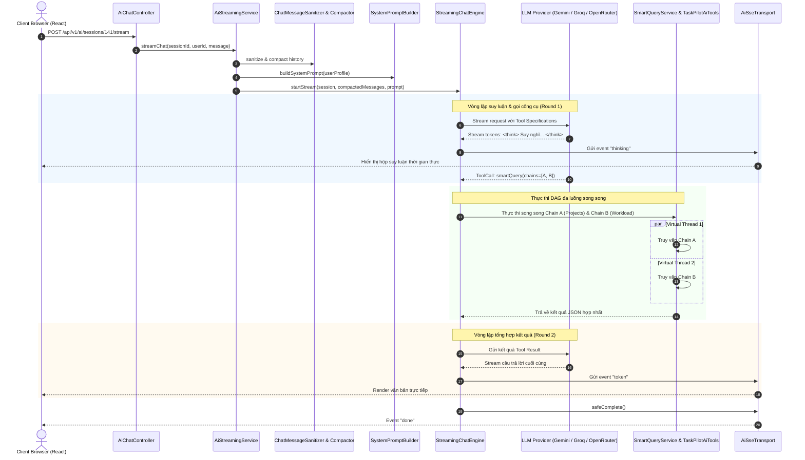

# Kiến Trúc Tái Cấu Trúc Module AI (TaskPilot AI Architecture Design)

Tài liệu này phân tích chi tiết thiết kế kiến trúc mục tiêu của module `taskpilot-ai`, minh họa bằng sơ đồ tương tác giữa các thành phần sau khi phân rã God-class `AiStreamingService`.

---

## 🏛️ Sơ Đồ Kiến Trúc Mục Tiêu (Target Architecture Diagram)

---

## ⚡ Luồng Xử Lý Dữ Liệu Single-Agent + Multi-Threaded DAG

Khác với mô hình Multi-Agent (nơi các agent trao đổi qua lại bằng văn bản tự nhiên gây trễ lớn), mô hình Single-Agent của TaskPilot sử dụng **Đồ thị có hướng không chu trình (DAG)** kết hợp **Java 25 Virtual Threads** để giải quyết các chuỗi truy vấn phức tạp:

---

## 🎯 Các Nguyên Tắc Thiết Kế Cốt Lõi (Design Principles)

1. **Facade Pattern**: `AiStreamingService` đóng vai trò cổng vào duy nhất, ẩn giấu toàn bộ sự phức tạp của việc xoay vòng key, timeout, tool parsing và SSE transport phía sau.
2. **Single Responsibility Principle (SRP)**: Mỗi class chỉ xử lý một miền logic duy nhất:
   - `ChatMessageSanitizer`: Chỉ biến đổi và làm sạch data cấu trúc tin nhắn.
   - `AiSseTransport`: Chỉ chịu trách nhiệm về giao thức mạng Server-Sent Events.
   - `ConfirmationBlockParser`: Chỉ bóc tách JSON và sinh schema form tương tác.
3. **Immutability & Stateless Beans**: Tất cả các component bóc tách đều là Spring Singletons phi trạng thái (Stateless), an toàn tuyệt đối khi chạy đồng thời trên hàng ngàn Virtual Threads.
4. **Resilience & Graceful Degradation**:
   - Khi hết quota key -> Xoay sang key phụ.
   - Khi LLM chính nghẽn -> Fallback sang model dự phòng.
   - Khi timeout 60s -> Fallback sang Text-Only thông báo rõ ràng cho người dùng.
