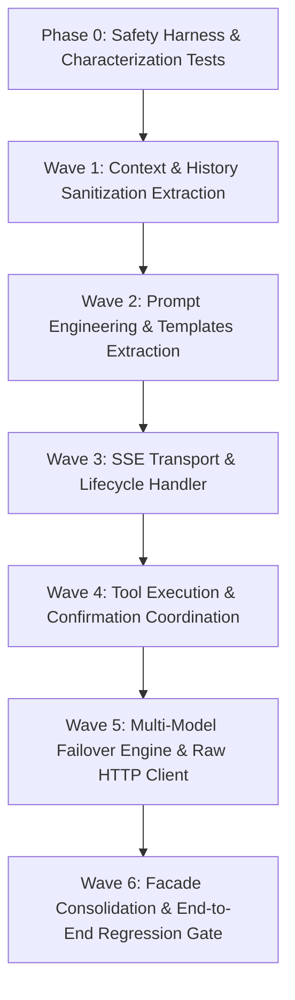

# AI Module Refactoring Workflow

This document defines the 6-phase wave-by-wave execution workflow for decomposing `AiStreamingService.java` (3,527 LOC) and `TaskPilotAiTools.java` (2,155 LOC) into maintainable, single-responsibility components.

---

## 🔄 Execution Roadmap Overview



---

## 🌊 Phase-by-Phase Execution Breakdown

### Phase 0: Safety Harness & Characterization Tests
**Objective**: Build a regression safety net before any line of production code is touched.
1. Create unit tests for pure utility and parsing logic currently buried in `AiStreamingService`:
   - `stripThinkBlocks()`, `extractAllThinkBlocks()`, `stripThinkTags()`.
   - `parseConfirmationPayload()`, `buildMissingAssignmentForm()`.
   - `cleanAndAlternateRoles()`, `compactHistoryForRequest()`.
2. Verify all tests pass with existing monolithic code:
   ```bash
   ./mvnw test -pl taskpilot-ai -Dtest=*CharacterizationTest -q
   ```

---

### Wave 1: Context & History Sanitization Subpackage (`com.taskpilot.ai.context`)
**Lines Targeted**: ~500 LOC from `AiStreamingService.java`.
1. **Extract `ChatMessageSanitizer.java`**:
   - `cleanAndAlternateRoles(List<ChatMessage> messages, boolean isGemini)`
   - `sameRole(ChatMessage m1, ChatMessage m2)`
   - `mergeMessages(ChatMessage m1, ChatMessage m2)`
   - `sanitizeHistoryForTools(List<ChatMessage> rawMessages)`
   - `extractAllThinkBlocks(String rawResponse)`
   - `stripThinkBlocks(String rawResponse)`
   - `stripThinkTags(String text)`
   - `stripToolCallJson(String text)`
2. **Extract `ChatHistoryCompactor.java`**:
   - `compactHistoryForRequest(List<ChatMessage> messages, String stage)`
   - `buildCompactedMessages(...)`
   - `buildCompactSummary(List<ChatMessage> olderMessages)`
   - `estimateTokens(List<ChatMessage> messages)`
   - `compactRole(ChatMessage message)`
   - `messageText(ChatMessage message)`
   - `compactText(String text, int maxChars)`
3. **Verification Gate**:
   - Run unit tests for `ChatMessageSanitizerTest` and `ChatHistoryCompactorTest`.
   - Verify `AiStreamingService` delegates cleanly to these two Spring beans.

---

### Wave 2: Prompt Engineering & Templates Subpackage (`com.taskpilot.ai.prompt`)
**Lines Targeted**: ~350 LOC from `AiStreamingService.java`.
1. **Extract `AiPromptConstants.java`**:
   - `SYSTEM_PROMPT_TEMPLATE` (150-line markdown prompt instructions).
   - Tool JSON format schemas, taskpilot-form block definitions.
2. **Extract `SystemPromptBuilder.java`**:
   - `buildSystemPrompt(Long userId)`
   - `withSystemPrompt(List<ChatMessage> history, String systemPrompt)`
   - `buildCompactSystemPrompt(String originalPrompt)`
   - `buildSimplerGemmaSystemPrompt(boolean isWriteIntent)`
   - `isSimpleAction(String userInput)`
   - `getInitialStep(String userInput)`
   - `getPeriodicSteps(String userInput)`
3. **Verification Gate**:
   - Verify output prompt string matches 100% character-for-character with legacy output.

---

### Wave 3: SSE Transport & Lifecycle Subpackage (`com.taskpilot.ai.streaming.sse`)
**Lines Targeted**: ~250 LOC from `AiStreamingService.java`.
1. **Extract `AiSseTransport.java`**:
   - `safeSend(SseEmitter emitter, String event, Object data, MediaType mediaType)`
   - `safeComplete(SseEmitter emitter, AtomicBoolean completed)`
   - `isClientAbort(Throwable error)`
   - `sendTokenToClient(...)`
   - Heartbeat and client disconnect detection (`AtomicBoolean clientDisconnected`).
2. **Extract `AiStreamEventFormatter.java`**:
   - Format standard event payloads: `token`, `thinking`, `thought`, `status`, `tool_call`, `error`, `done`.
3. **Verification Gate**:
   - Mock `SseEmitter` unit test verifying no `IllegalStateException` or `IOException` leaks on client abort.

---

### Wave 4: Tool Execution & Confirmation Subpackage (`com.taskpilot.ai.streaming.tool`)
**Lines Targeted**: ~500 LOC from `AiStreamingService.java`.
1. **Extract `StreamingToolCoordinator.java`**:
   - `executeTools(ChatSessionEntity session, List<ToolExecutionRequest> toolRequests, ...)`
   - Tool loop state tracking: `advanceToolLoopState(...)`, `MAX_CONSECUTIVE_SAME_TOOL_EXECUTIONS = 3`.
   - `getFriendlyToolName(...)`, `getFriendlyToolResultSummary(...)`.
   - `formatAllToolResults(...)`, `formatToolResultsForLlama(...)`.
2. **Extract `ConfirmationBlockParser.java`**:
   - `parseConfirmationPayload(String rawToolOutput)`
   - `buildMissingAssignmentForm(String toolName, String rawArguments, String rawToolOutput)`
   - `appendTaskPilotBlocks(String responseText, List<Map<String, Object>> toolCallSummaries)`
   - `confirmationBlockKey(Map<?, ?> confirmation)`
   - `nestedValue(Map<?, ?> source, String parentKey, String childKey)`
3. **Verification Gate**:
   - Run `TaskPilotAiToolsHumanInLoopTest` and new `ConfirmationBlockParserTest`.

---

### Wave 5: Multi-Model Failover & Raw Client Subpackage (`com.taskpilot.ai.streaming.engine`)
**Lines Targeted**: ~1,200 LOC from `AiStreamingService.java`.
1. **Extract `DirectOpenAiModelClient.java`**:
   - `callGemmaDirectly(ChatRequest chatRequest, String modelName, int toolRound, boolean requiresTools)`
   - `mapMessageToOpenAi(ChatMessage message)`
   - `mapToolToOpenAi(ToolSpecification spec)`
   - `jsonSchemaElementToMap(...)`
2. **Extract `TimeoutFallbackHandler.java`**:
   - `handleFirstResponseTimeout(...)`
   - `forceTextOnlyResponse(...)`
   - `finalizeForceTextOnlyResponse(...)`
   - `buildTextOnlyTimeoutResponse(...)`
3. **Extract `StreamingChatEngine.java`**:
   - `doStream(...)`, `doStreamWithKeyAttempts(...)`
   - `streamRound(...)`
   - Key rotation logic: `hasRemainingKeys(...)`, `getModelKeyLabel(...)`
   - `streamIntermediateResponseAndContinue(...)`
4. **Verification Gate**:
   - Compile verification with zero warnings.
   - Test key rotation and timeout fallback triggers.

---

### Wave 6: Facade Consolidation & End-to-End Regression Gate
**Lines Targeted**: Refactor `AiStreamingService.java` to become a clean Facade (<350 LOC).
1. `AiStreamingService.java` retains only:
   - Dependency injection of extracted components.
   - Public method: `public SseEmitter streamChat(Long sessionId, Long userId, String userInput, String clientMessageId)`.
   - Lifecycle method: `public void shutdown()`.
   - Async session title trigger: `generateSessionTitleViaGemmaAsync(...)`.
2. Full Integration Verification:
   ```bash
   ./mvnw clean test -pl taskpilot-ai -B
   bash taskpilot/scripts/verify-hf-deploy.sh
   ```
3. Quality Gate:
   - `AiStreamingService.java` reduced from 3,527 LOC to ~300 LOC (-91%).
   - All 8 extracted classes under 400 LOC.
   - 100% test pass rate.
