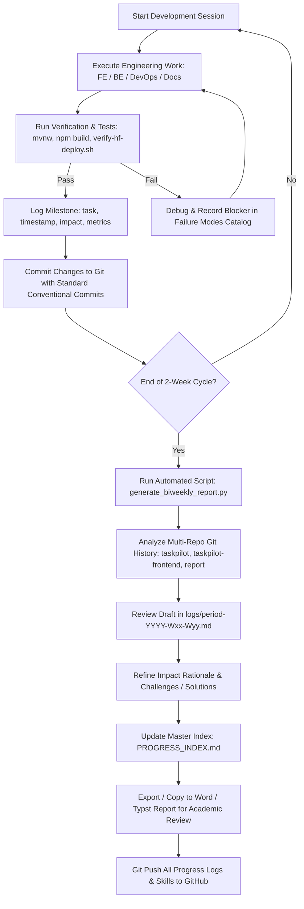

# Bi-Weekly Progress Tracking & Reporting Workflow

This document specifies the end-to-end workflow for tracking development tasks, extracting metrics, articulating technical rationale, and generating bi-weekly reports for UIT Đồ án 2 (SE121).

---

## 🔄 Workflow Diagram



---

## 🛠 Step-by-Step Instructions

### Phase 1: Micro-Logging (During Development)
Whenever a feature, refactor wave, or bug fix is finished:
1. Note the commit hash or branch name.
2. Quantify what changed:
   - Lines of code added/removed (`git diff --stat`).
   - Compilation and test pass status (`./mvnw test -q`, `npm run build`).
3. Fill in the rationale:
   - **Vấn đề trước khi làm**: Code bị trùng lặp ở đâu? Nguy cơ crash khi deploy là gì?
   - **Giải pháp áp dụng**: Tách class, dùng helper, cấu hình UID 1000, fallback ENV.
   - **Tác dụng thực tế**: Tiết kiệm tài nguyên, dễ mở rộng tính năng mới (chuẩn bị cho RAG / Teams-clone).

### Phase 2: Automated Git Aggregation (Bi-Weekly)
Every 14 days, run:
```bash
python3 progress-tracker/scripts/generate_biweekly_report.py --period 2026-W35-W36 --start-date 2026-08-25 --end-date 2026-09-08
```
This script will:
- Query `git log` across all 3 sub-projects (`taskpilot`, `taskpilot-frontend`, `report`).
- Aggregate commits by category (`refactor`, `feat`, `fix`, `docs`, `test`, `chore`).
- Calculate overall delta: lines added, lines deleted, net LOC reduction.
- Generate a pre-filled markdown file at `progress-tracker/logs/period-2026-W35-W36.md`.

### Phase 3: Impact Analysis & Qualitative Enrichment
Open the generated markdown draft and complete the qualitative sections:
1. **Liên kết với Đề cương Đồ án 2**:
   - Xác định công việc thuộc nhóm ưu tiên nào:
     - **P0**: Tái cấu trúc kiến trúc hệ thống (dọn nền, tách God files).
     - **P1**: Hệ thống RAG (LangChain4j, pgvector, Apache Tika).
     - **P2**: Hệ thống cộng tác tối giản (Teams-clone: Files, Chat, Meeting, Recording).
     - **P3**: Observability (Prometheus, Grafana trên HF Space), Authentik IAM, Adaptive Weights.
2. **Khó khăn & Vướng mắc (Blockers)**:
   - Ghi lại các lỗi gặp phải và giải pháp xử lý triệt để (ví dụ: lỗi cấu hình mail actuator gây restart loop, lỗi port 8080 trong YAML, Alpine musl DNS IPv4).
3. **Kế hoạch 2 tuần tới**:
   - Liệt kê các mục tiêu của Sprint tiếp theo kèm assignee và hạn hoàn thành.

### Phase 4: Master Index Update & GitHub Synchronization
1. Append the summary row to `progress-tracker/PROGRESS_INDEX.md`.
2. Commit all changes across repos and push:
   ```bash
   git add progress-tracker/
   git commit -m "docs(progress): record bi-weekly progress for 2026-W35-W36"
   git push origin main
   ```
