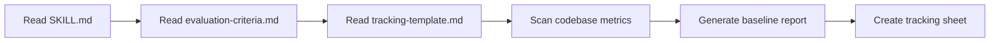

# Refactor Workflow — Step-by-Step

## Phase 0: Preparation (Không viết code)



1. Đọc tất cả references trong skill này
2. Scan codebase để lấy baseline metrics (file count, total lines)
3. Tạo tracking sheet từ template
4. Xác nhận với user trước khi bắt đầu

## Phase 1: Backend Refactor

### Wave 1.1 — Foundation Utilities (Ưu tiên cao nhất)

Tạo các utility/helper mới sẽ được dùng lại ở các wave sau.

| Step | File/Area | Action | Expected Savings |
|---|---|---|---|
| 1.1.1 | `ApiResponse.java` | Thêm overload methods ngắn gọn: `ok(data)`, `ok(msg, data)`, `created(data)` | ~200 lines across controllers |
| 1.1.2 | `UserResolverUtils` | Centralize `getCurrentUserIdByEmail` (currently duplicated in 7 files) | ~35 lines |
| 1.1.3 | `PageableUtils` | Centralize `buildSafePageable` (currently duplicated in 3 files) | ~45 lines |
| 1.1.4 | `ProjectSecurityService` | Centralize `validateMember/Manager/NotArchived` (duplicated in 4 services) | ~80 lines |
| 1.1.5 | `ValidationUtils` | Centralize `validateDateRange` (duplicated in 3 files) | ~15 lines |
| 1.1.6 | `@CurrentUserEmail` resolver | Custom annotation + `HandlerMethodArgumentResolver` | Foundation |

**Gate check:** `./mvnw compile -q` phải pass

### Wave 1.2 — Controllers (Giảm boilerplate mạnh nhất)

| Step | File | Current Lines | Target Reduction |
|---|---|---|---|
| 1.2.1 | `ProjectController.java` | 157 | 25-35% |
| 1.2.2 | `TaskController.java` | 108 | 25-35% |
| 1.2.3 | `SprintController.java` | 107 | 25-35% |
| 1.2.4 | `TaskCommentController.java` | 99 | 20-30% |
| 1.2.5 | `AuthController.java` | 104 | 20-30% |
| 1.2.6 | `NotificationController.java` | 88 | 20-30% |
| 1.2.7 | `AdminUserController.java` | 73 | 15-25% |
| 1.2.8 | `SkillController.java` | 68 | 15-25% |
| 1.2.9 | Remaining controllers | ~200 | 15-25% |

**Gate check:** `./mvnw compile -q` + `./mvnw test -q`

### Wave 1.3 — Services (Cẩn thận, logic-sensitive)

| Step | File | Current Lines | Target Reduction |
|---|---|---|---|
| 1.3.1 | `ProjectServiceImpl.java` | 493 | 10-20% |
| 1.3.2 | `TaskService.java` | 397 | 10-20% |
| 1.3.3 | `SprintService.java` | 253 | 10-15% |
| 1.3.4 | `TaskCommentService.java` | 634 | 10-15% |
| 1.3.5 | `AuthService.java` | 152 | 10-15% |
| 1.3.6 | `AdminUserService.java` | 183 | 10-15% |
| 1.3.7 | `NotificationService.java` | 122 | 10-15% |

**Gate check:** `./mvnw test -q` (CRITICAL — mọi test phải pass)

### Wave 1.4 — AI Service (Phức tạp nhất, cẩn thận nhất)

| Step | File | Current Lines | Target Reduction |
|---|---|---|---|
| 1.4.1 | `AiStreamingService.java` | 3527 | 5-15% (conservative) |
| 1.4.2 | `TaskPilotAiTools.java` | 2156 | 10-20% (split into domain-specific tool classes) |
| 1.4.3 | `SmartRoutingService.java` | 824 | 5-10% |
| 1.4.4 | `ToolCallingRegistryService.java` | 724 | 5-10% |
| 1.4.5 | `SmartQueryService.java` | 719 | 5-10% |
| 1.4.6 | `AutoAssignmentService.java` | 376 | 5-10% |

**Gate check:** `./mvnw compile -q` + manual AI chat test

### Wave 1.5 — DTOs & Entities (Quick wins)

| Step | Action | Expected Reduction |
|---|---|---|
| 1.5.1 | Convert eligible DTO classes → Java records | 20-40% per file |
| 1.5.2 | Remove redundant Lombok annotations | 5-10% |
| 1.5.3 | MapStruct — apply `unmappedTargetPolicy = IGNORE` | 10-20% per mapper |

**Gate check:** `./mvnw compile -q`

---

## Phase 2: Frontend Refactor

### Wave 2.0 — Dead Code Removal (Free wins, zero risk)

| Step | File/Item | Lines Saved | Action |
|---|---|---|---|
| 2.0.1 | `src/App.tsx` | 50 | Delete (Vite template leftover, unused) |
| 2.0.2 | `src/App.css` | 35 | Delete (unused) |
| 2.0.3 | `src/components/LiquidCard.tsx` | 60 | Delete (unused demo card) |
| 2.0.4 | `src/components/ui/toast.tsx` + `toaster.tsx` + `src/hooks/use-toast.ts` | ~350 | Delete (shadcn toast — project uses `react-toastify`) |
| 2.0.5 | Unused npm packages | - | `npm uninstall @assistant-ui/react @assistant-ui/react-markdown` |
| | **Wave 2.0 Total** | **~495** | **Zero risk, instant savings** |

**Gate check:** `npx tsc --noEmit` + `npm run build`

### Wave 2.1 — Foundation Utilities

| Step | File/Area | Action |
|---|---|---|
| 2.1.1 | `lib/http.ts` | Tạo typed wrapper: `api.get<T>(url, params?)` trả thẳng `ApiResponse<T>` thay vì `AxiosResponse<ApiResponse<T>>` |
| 2.1.2 | `hooks/useAsyncData.ts` | Extract repeated `isLoading + try/catch/finally + toast.error` pattern |
| 2.1.3 | `hooks/usePaginatedSplitView.ts` | Extract shared pagination state (`currentPage`, `pageSize`, `keyword`, `mode`, `totalElements`, etc.) |
| 2.1.4 | `hooks/useLeaveProject.ts` | Extract identical `handleLeaveProject` (30 lines × 2 files) |
| 2.1.5 | `hooks/useTaskActions.ts` | Extract identical task mutation logic (3 handlers × 2 files) |
| 2.1.6 | `utils/mergeById.ts` | Extract identical `mergeById` function (2 files) |
| 2.1.7 | `components/PasswordField.tsx` | Reusable password input with toggle (used in 4 auth pages) |

**Gate check:** `npx tsc --noEmit`

### Wave 2.2 — Service Files (Quick wins, an toàn)

| Step | File | Current Lines | Target Reduction |
|---|---|---|---|
| 2.2.1 | `project.service.ts` | 82 | 30-40% |
| 2.2.2 | `task.service.ts` | 99 | 30-40% |
| 2.2.3 | `sprint.service.ts` | 57 | 30-40% |
| 2.2.4 | `admin.service.ts` | 146 | 30-40% |
| 2.2.5 | Remaining services (7 files) | ~296 | 25-35% |

**Gate check:** `npx tsc --noEmit` + `npm run build`

### Wave 2.3 — Page Components (Biggest impact)

| Step | File | Current Lines | Target Reduction | Strategy |
|---|---|---|---|---|
| 2.3.1 | `AiChatPage.tsx` | 3352 | 30-40% | Extract 5-6 sub-components + `useChatStream` hook |
| 2.3.2 | `ProjectWorkspacePage.tsx` | 1815 | 25-35% | Extract tab modules (Board, Backlog, Timeline) |
| 2.3.3 | `AdminSettingsPage.tsx` | 855 | 15-25% | Use `usePaginatedSplitView` |
| 2.3.4 | `ProjectsPage.tsx` | 690 | 15-25% | Use `usePaginatedSplitView` |
| 2.3.5 | `MySkillsPage.tsx` | 606 | 15-20% | Use `usePaginatedSplitView` |
| 2.3.6 | `ProjectSettingsPage.tsx` | 549 | 15-20% | Use `useLeaveProject` hook |
| 2.3.7 | `AdminUsersPage.tsx` | 520 | 15-20% | Use `usePaginatedSplitView` |
| 2.3.8 | `AdminGlobalSkillsPage.tsx` | 453 | 15-20% | Use `usePaginatedSplitView` |
| 2.3.9 | `ProfilePage.tsx` | 440 | 10-15% | |
| 2.3.10 | Remaining pages | ~1828 | 10-15% | |

**Gate check:** `npx tsc --noEmit` + `npm run build` + visual spot-check

### Wave 2.4 — Components (Cẩn thận UI)

| Step | File | Current Lines | Target |
|---|---|---|---|
| 2.4.1 | `ActivityTimeline.tsx` | 925 | 20-25% (extract `useCommentStream` hook + `MentionTextarea`) |
| 2.4.2 | `TaskMetadataSidebar.tsx` | 185 | 10-15% |
| 2.4.3 | `LabelSelector.tsx` | 172 | 10-15% |
| 2.4.4 | `JSONRenderer.tsx` | 143 | 10-15% |
| 2.4.5 | `MainLayout.tsx` | 585 | 15-20% (extract notification SSE logic) |

**⚠️ KHÔNG chạm:** `components/ui/*` (shadcn/ui generated, trừ dead code toast đã xóa ở Wave 2.0)

**Gate check:** `npm run build` + responsive check

### Wave 2.5 — Auth Form Migration (Clean wins)

| Step | File | Current Lines | Target Reduction | Strategy |
|---|---|---|---|---|
| 2.5.1 | `LoginPage.tsx` | 114 | 20-30% | Migrate to `react-hook-form` + `zod` + `PasswordField` |
| 2.5.2 | `RegisterPage.tsx` | 158 | 30-40% | Migrate to `react-hook-form` + `zod` + `PasswordField` |
| 2.5.3 | `ForgotPasswordPage.tsx` | 113 | 15-20% | Migrate to `react-hook-form` + `zod` |
| 2.5.4 | `ResetPasswordPage.tsx` | 139 | 25-35% | Migrate to `react-hook-form` + `zod` + `PasswordField` |

**Gate check:** `npm run build` + manual auth flow test

---

## Phase 3: Verification & Report

1. Run full BE test suite
2. Run full FE build
3. Generate final metrics report
4. Compare against baseline
5. Create summary artifact

---

## Rollback Strategy

Mỗi wave tạo 1 git commit riêng với message format:
```
refactor(wave-X.Y): [area] - reduce N lines (X% reduction)
```

Nếu bất kỳ gate check nào fail → `git revert` wave commit đó → fix → retry.
