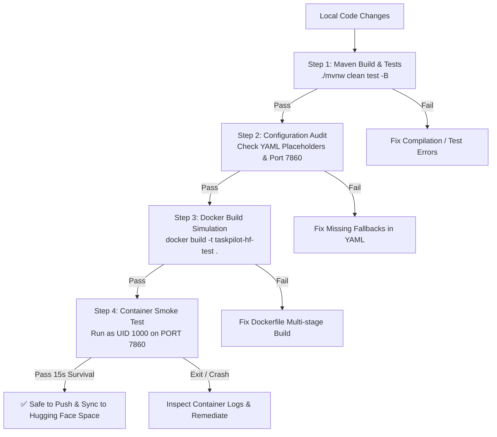

# 🔄 Hugging Face Deployment Verification Workflow

Automated workflow for validating TaskPilot backend prior to deployment.



## Running the Automated Pipeline

From project root:
```bash
bash taskpilot/scripts/verify-hf-deploy.sh
```

### Steps Executed:
1. **Maven Clean Package**: Compiles with Java 25 (`--enable-preview`) and runs test suites.
2. **Docker Build**: Builds multi-stage Docker image on `eclipse-temurin:25-jdk-alpine` and `eclipse-temurin:25-jre-alpine`.
3. **Container Smoke Test**:
   - Launches container with `--user 1000:1000` (simulating HF orchestrator).
   - Binds port `7865:7860` with `PORT=7860`.
   - Passes test credentials and checks process survival after 15 seconds.
   - Cleans up container.
