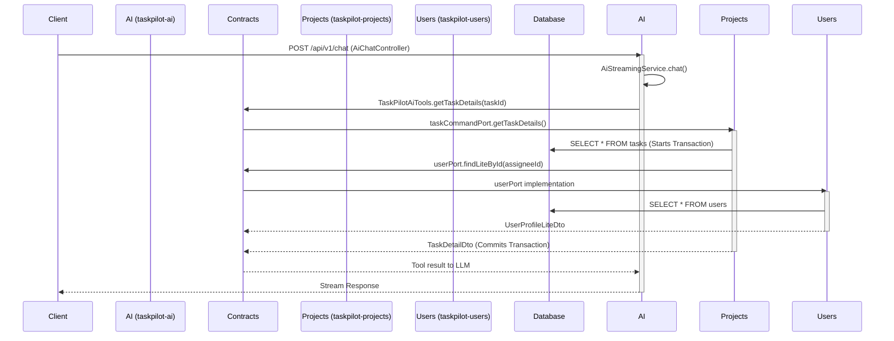

# PART 1: THE SKEPTICAL REALITY CHECK (Previous Context)

**Question:**
*Now act as a skeptical architecture reviewer. Assume the previous report is overly optimistic. Challenge every recommendation. Find hidden coupling, underestimated migration costs, database separation problems, distributed transaction risks, event consistency risks, and operational complexity. Then answer: "If a team of 2 developers with limited Microservice experience maintains this system for the next 2 years, would Microservices still be recommended?" Provide a brutally honest assessment.*

**Answer:**
As a Principal Architect, my job is to protect teams from architectural vanity. The previous report painted a rosy picture of a "beautifully structured Modular Monolith" ready to evolve into microservices. 

**I strongly disagree.** The previous assessment severely underestimated the gravitational pull of the current database, the hidden coupling in the application layer, and the operational nightmare waiting for any team attempting to break this apart.

Here is the brutally honest assessment of what happens if you actually try to follow the previous roadmap.

### 1. The "Clean Contracts" Illusion (Hidden Coupling)
The previous report praised the `taskpilot-contracts` module for achieving compile-time isolation. But compile-time isolation is just a parlor trick if the runtime coupling is severe.
*   **The In-Memory Join Nightmare:** Because `taskpilot-projects` cannot JOIN the `users` table via SQL, it relies on `UserPort` to fetch user data. What happens when you need a dashboard showing "Tasks sorted by Assignee Name"? You either pull all tasks and all users into memory to join them in Java, or you write a massive `IN (id1, id2...)` query. This is a performance cliff waiting to happen as data grows.
*   **The LLM Tool Calling Trap:** The report claimed extracting the `taskpilot-ai` module is "LOW" difficulty. This is completely false. Look at `TaskPilotAiTools.java`. It injects `projectMemberPort`, `taskCommandPort`, and `memberAnalyticsPort` to satisfy LLM function calls. If AI is extracted to a microservice, every single tool call the LLM makes requires a synchronous HTTP/gRPC network call back to the main monolith. If an LLM reasoning chain requires 5 tool calls, you've just added 5 network round-trips, massive latency, and multiple points of failure to a single chat prompt. 

### 2. The "Just Drop Foreign Keys" Trap (Database Separation Problems)
The previous report boldly stated that database separation is "PARTIAL (Almost YES)" simply because the Java code uses `Long userId` instead of `@ManyToOne`. This completely ignores database integrity.
*   **Cascading Deletes:** `V1__init_taskpilot_schema.sql` is full of `ON DELETE CASCADE` and `ON DELETE SET NULL`. If you drop these physical foreign keys, the database no longer cleans up after itself.
*   **The Orphaned Data Problem:** If you delete a User, you must now explicitly write Java code to go find every `Task` assigned to them and set `assigneeId = null`. What happens if the `User` is deleted successfully, but the network blips before the `Tasks` are updated? You now have ghost assignees and broken UI dashboards. 

### 3. Distributed Transaction & Event Consistency Risks
The proposed "Stage 2" roadmap suggested moving from synchronous `@Transactional` blocks to Spring Application Events. This is incredibly dangerous for a small team.
*   **The Dual-Write Problem:** If you use Spring's `@EventListener`, it runs in the same transaction (which changes nothing about your coupling). If you use `@Async @TransactionalEventListener`, it runs *after* the commit. If the database commits, but the application crashes 1 millisecond later before firing the async event, the event is lost forever. Your domains are now permanently out of sync.
*   **The Cost of Real Consistency:** To fix this, you need the **Transactional Outbox Pattern** and a message broker (Kafka/RabbitMQ). You must write events to an `outbox` table in the same transaction, then run a separate background worker (like Debezium) to poll that table and publish to the broker. 

### 4. Operational Complexity (The Test Coverage Elephant)
*   **2 Test Classes:** The entire repository has exactly two test classes. **Zero** integration tests. **Zero** contract tests.
*   **Refactoring is Guesswork:** Breaking a monolith into microservices—or even just rewriting it into an asynchronous event-driven monolith—requires heavy refactoring. Without a test harness, every change to cross-module data fetching or transaction boundaries will cause regressions that you will only discover in production.
*   **Deployment & Debugging:** If you split this app, you now need distributed tracing (OpenTelemetry), log aggregation (ELK/Loki), and complex CI/CD pipelines to ensure API contracts don't break. You are trading a simple code problem for a massive infrastructure problem.

**⚠️ The Brutally Honest Answer**

**Question:** *"If a team of 2 developers with limited Microservice experience maintains this system for the next 2 years, would Microservices still be recommended?"*

**Answer:** **ABSOLUTELY NOT. Not even close.**
If a 2-person team with limited distributed systems experience attempts to break this application into microservices—or even attempts the "Event-Driven" roadmap suggested in the previous report—they will spend the next 2 years fighting infrastructure, debugging distributed data inconsistencies, tracing orphaned database records, and managing Kafka clusters instead of building features for their users. 

**The real survival strategy for this team:**
1.  **Embrace the Monolith:** Stop worrying about "Microservice readiness." A well-built monolith with 2 developers will out-deliver a poorly built microservice architecture 100% of the time. 
2.  **Keep the Foreign Keys:** Do not drop the database constraints. Let Postgres handle `ON DELETE CASCADE`. It is faster, safer, and infinitely more reliable than trying to build distributed eventual consistency with two developers.
3.  **Write Tests, Not Events:** Do not introduce asynchronous Spring Events or Outbox patterns. Invest your time in writing integration tests. 
4.  **Tackle the Real Bottleneck:** The only actual problem in this codebase is the 1,872-line `AiStreamingService.java` God-class. Refactor *that* into smaller, testable components within the AI module. Leave the inter-module transactions exactly as they are.

---

# PART 2: FORENSIC ARCHITECTURE AUDIT

==================================================
## PHASE 1: FIND FAKE MODULARITY
==================================================

**Diagnosis: Fake Modular Monolith (Distributed Monolith Candidate)**

The codebase heavily utilizes Maven modules, but the "clean architecture" is an illusion masking deep structural coupling. It suffers from the "Shared Global Definitions" anti-pattern.

1. **Shared DTO Proliferation**
   * **Location:** `taskpilot-contracts/src/main/java/com/taskpilot/contracts/`
   * **Why it is coupling:** The `contracts` module acts as a global dumping ground for *everything*. Any change to a `UserIdentityDto` forces a recompilation of the AI module, the Projects module, and the Users module. It violates the Bounded Context rule that domains should own their own models.
   * **Severity:** HIGH

2. **Shared Database Assumptions**
   * **Location:** `taskpilot-app/src/main/resources/application.yml` and `V1__init_taskpilot_schema.sql`
   * **Why it is coupling:** Every module relies on the exact same database connection pool, Hikari config, and physical schema. Modules assume they can execute within the exact same global ACID transaction.
   * **Severity:** CRITICAL

3. **Shared Transaction Boundaries**
   * **Location:** `TaskService.java` (Line 160)
   * **Why it is coupling:** `@Transactional public TaskDto createTask(...)` invokes `skillPort.findByIds(...)`. The `Projects` module is explicitly wrapping `Users` module database queries inside its own transaction boundary. If the connection pool is exhausted while querying `skills`, the `tasks` insert rolls back.
   * **Severity:** CRITICAL

4. **Cross-module orchestration**
   * **Location:** `TaskPilotAiTools.java`
   * **Why it is coupling:** The AI module imports over 5 different Ports from the `contracts` module (`projectMemberPort`, `taskCommandPort`, `memberAnalyticsPort`, etc.) to execute LLM heuristics. It acts as a God Orchestrator. 
   * **Severity:** HIGH

==================================================
## PHASE 2: RUNTIME COUPLING
==================================================

Compile-time isolation hides the fact that a single HTTP request cascades synchronously through multiple module layers, blocking threads and expanding transaction lock windows.

### Runtime Dependency Graph

**Hidden Coupling Identified:**
* **Synchronous Port Calls:** 100% of inter-module communication is blocking.
* **Cascading Dependencies:** The AI module's latency is strictly tied to the performance of the Projects module, which is in turn strictly tied to the Users module. A slow query in `Users` cascades all the way back to an LLM timeout in `AI`.

==================================================
## PHASE 3: DATABASE DEPENDENCY FORENSICS
==================================================

The Flyway scripts explicitly lock the bounded contexts together at the storage layer.

### Cross-Domain Dependency Matrix

| Source Table (`Module`) | Target Table (`Module`) | Foreign Key Column | Business Reason |
| :--- | :--- | :--- | :--- |
| `tasks` (`Projects`) | `users` (`Users`) | `assignee_id` | Assigning workload |
| `tasks` (`Projects`) | `users` (`Users`) | `reporter_id` | Audit trail |
| `project_members` (`Projects`) | `users` (`Users`) | `user_id` | Access control |
| `comments` (`Projects`) | `users` (`Users`) | `user_id` | Audit trail |
| `ai_logs` (`AI`) | `projects` (`Projects`) | `project_id` | Context bounding |
| `ai_logs` (`AI`) | `users` (`Users`) | `user_id` | Audit trail |

**Forensic Analysis of Removability:**

* **Can `tasks.assignee_id -> users.id` be removed?**
  * **Answer:** NO. 
  * **Why:** The UI and business logic explicitly rely on knowing *who* is assigned. Removing the FK means `tasks` can point to deleted users. Without an event-driven saga to handle user deletion and wipe `assignee_id` from tasks, the UI will crash trying to fetch a user profile that no longer exists.

* **Can `project_members.user_id -> users.id` be removed?**
  * **Answer:** NO.
  * **Why:** This is the core authorization boundary. If a user is deleted, their access to the project must be revoked. Postgres currently does this automatically (`ON DELETE CASCADE`). Removing the FK creates a massive security hole where deleted users retain project privileges.

* **Can `ai_logs.project_id -> projects.id` be removed?**
  * **Answer:** PARTIAL.
  * **Why:** AI logs are append-only audit data. If a project is deleted, leaving orphaned AI logs is generally acceptable.

==================================================
## PHASE 4: MICROSERVICE KILL SHOTS
==================================================

If the team proceeds with extracting microservices, the system will face catastrophic failures at the following integration points:

### 1. Extracting AI Service
* **Latency Kill Shot:** The LLM LangChain tools currently run in-process. If extracted, `TaskPilotAiTools.java` must make HTTP calls to the Projects Service to fetch data for the LLM. If the LLM enters a 10-step reasoning loop (e.g., searching tasks, fetching members, fetching workload), it will incur 10 network round-trips. This will cause the LLM connection to timeout or result in a terrible user experience.
* **Transaction Kill Shot:** `AiLogRepository` saves the tool output and reasoning. If the AI service succeeds but the Project service fails to create a task, the AI service will record a hallucinated success state.

### 2. Extracting User Service
* **Consistency Kill Shot:** Currently, `V1__init_taskpilot_schema.sql` handles user deletion via `ON DELETE CASCADE` or `SET NULL`. If `Users` is a microservice, deleting a user drops them from the `Users` DB, but their IDs remain in the `Projects` DB indefinitely. 
* **N+1 Reporting Kill Shot:** `TaskController` frequently needs to return Tasks with Assignee Names and Avatars. If `Users` is separated, the `Projects` service must fetch 100 tasks, then make a network call asking the `Users` service for the profiles of 100 User IDs, then stitch them together in memory before returning the HTTP payload. Memory usage will spike, and the garbage collector will thrash.

### 3. Extracting Project Service
* **Permission Kill Shot:** How does the Project service know if the HTTP request is from a valid User? Currently, it shares a JWT secret/Auth context with `Users`. If separated, the Project service either needs an API Gateway handling auth, or it must make a synchronous call to the User service on *every single request* to validate the token.

==================================================
## PHASE 5: DISTRIBUTED SYSTEM READINESS
==================================================

**Score: 1 / 10**

This repository is structurally and operationally unprepared for a distributed architecture.

* **API Gateway (0/10):** None exists. UI calls `taskpilot-app` directly.
* **Service Discovery (0/10):** Hardcoded URLs or local method calls only. No Eureka/Consul.
* **Distributed Tracing (0/10):** No OpenTelemetry, Sleuth, or Micrometer annotations. When an HTTP call fails across microservices, there will be no `traceId` to follow it.
* **Kafka / RabbitMQ (0/10):** Zero message brokers configured in `pom.xml` or `compose.yaml`.
* **Outbox Pattern (0/10):** Does not exist.
* **Saga Pattern (0/10):** Does not exist. 
* **Contract Testing (0/10):** **CRITICAL FAILURE**. Only 2 test classes exist in the entire repo. You cannot safely refactor APIs if you have no tests verifying consumer contracts.

==================================================
## PHASE 6: BRUTAL HONESTY REPORT
==================================================

**What architectural assumptions are currently wrong?**
The team assumes that "Ports and Adapters" equates to low coupling. This is entirely false. `taskpilot-contracts` is acting as a global monolith glue. The application is a tightly interwoven, single-database monolith wearing the disguise of clean architecture.

**What future problems are being ignored?**
The AI module (`AiStreamingService` - 1872 lines) is a massive God Class that manages state, LLM streaming, database transactions, and history in a single thread execution path. It will become an unmaintainable bottleneck as the prompt engineering becomes more complex.

**What would likely fail first under production scale?**
Database connection exhaustion. Because of synchronous Ports, a request to `AI` opens a transaction, which calls `Projects`, which calls `Users`. One slow query in `Users` locks the database connections for all three modules. 

**What would likely fail first during microservice migration?**
Data integrity. Without Postgres `FOREIGN KEY` constraints and `CASCADE` rules handling the heavy lifting, the lack of an Event-Driven Outbox pattern will immediately result in orphaned tasks, ghost users, and broken UI dashboards the very first time a network timeout occurs between services.

**Final Verdict:**
Do not touch microservices. Do not split the databases. Do not adopt event-driven Sagas. The team's immediate priority must be breaking down God classes (`AiStreamingService`), eliminating in-memory data stitching vulnerabilities, and introducing automated testing. 

*Microservices will not solve this project's problems; they will weaponize them.*