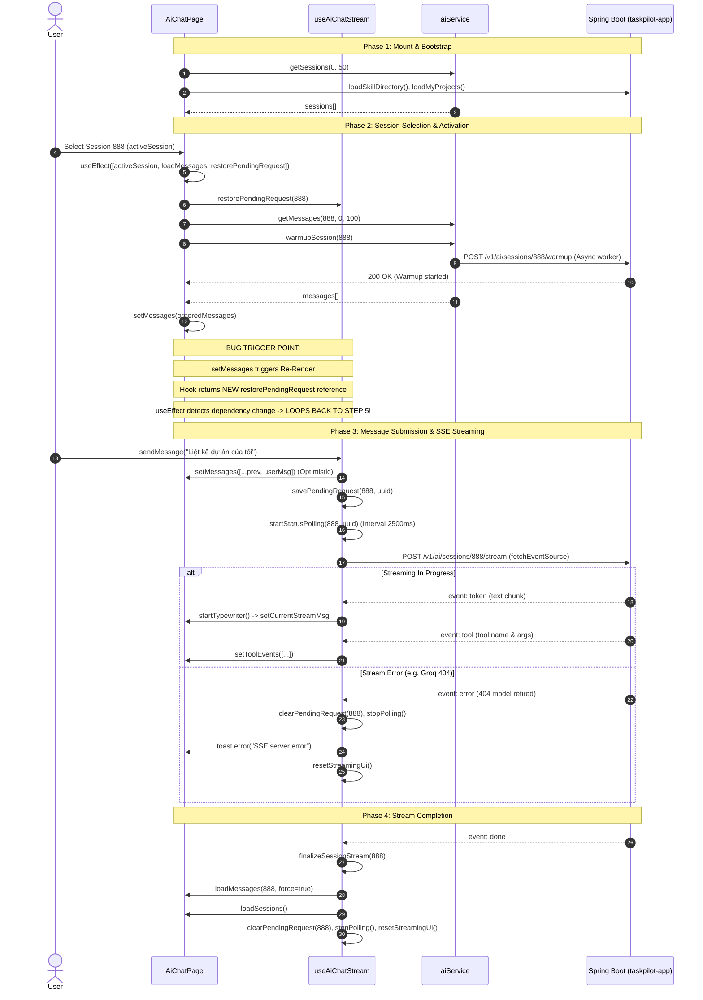

# AI Chat Frontend Audit — TaskPilot

**Date:** September 2026  
**Target Subsystem:** TaskPilot AI Copilot / AI Chat Frontend  
**Audited Components:** `AiChatPage.tsx`, `useAiChatStream.ts`, `ai.service.ts`, `AiSessionSidebar.tsx`, `main.tsx`  
**Git Branch:** `feat/rag-storage`  

---

## 1. Executive Summary

During testing of the AI Chat and RAG integration in TaskPilot, the backend log stream was inundated with rapid, repetitive log entries:
```text
[Cache Warming] Starting cache warmup for user 3 in session 888
[LocalCache] HIT for read tool queryProjects (session=888, user=3)
[LocalCache] HIT for read tool getMyNotifications (session=888, user=3)
[LocalCache] HIT for read tool getMySkills (session=888, user=3)
[Cache Warming] Cache warmup completed for user 3 in session 888
```
These entries were repeating continuously at approximately **~250ms intervals (4 requests per second)**. Concurrently, AI chat streaming requests were crashing due to model 404 errors (`com.openai.errors.NotFoundException: 404: The model llama-3.3-70b-versatile does not exist or you do not have access to it`).

This audit investigated the entire frontend AI chat lifecycle to verify whether the warmup loop is an artifact of React Strict Mode, a hidden polling timer, an SSE reconnection loop, or an effect dependency cycle.

### Key Audit Findings
1. **The Primary Root Cause is a Classic React Effect Dependency Cycle:**
   In [AiChatPage.tsx](file:///d:/HK6-UIT/DA1/taskpilot-frontend/src/pages/AiChatPage.tsx#L142-L153), the session activation effect declares `[activeSession, loadMessages, restorePendingRequest]` in its dependency array. The function `restorePendingRequest` returned by [useAiChatStream.ts](file:///d:/HK6-UIT/DA1/taskpilot-frontend/src/hooks/useAiChatStream.ts#L304) is declared as a plain arrow function without `useCallback`. Every time `loadMessages` resolves and calls `setMessages`, `AiChatPage` re-renders, producing a brand-new function reference for `restorePendingRequest`. React detects this reference change (`newRef !== prevRef`) and immediately re-executes the effect, triggering another round of `warmupSession` and `loadMessages`.
2. **The ~250ms Cadence is the Network Round-Trip Latency:**
   There is no 250ms timer in the frontend code. The interval corresponds precisely to the HTTP turnaround time: `loadMessages` (`GET /v1/ai/sessions/888/messages`) + `warmupSession` (`POST /v1/ai/sessions/888/warmup`) $\rightarrow$ state dispatch $\rightarrow$ component re-render $\rightarrow$ effect re-execution.
3. **React Strict Mode Doubles Initial Mounts, but Does Not Cause the Loop:**
   `<StrictMode>` is enabled in [main.tsx](file:///d:/HK6-UIT/DA1/taskpilot-frontend/src/main.tsx#L27). In development, it executes the mount effect twice (yielding 2 warmup calls initially). However, the infinite runaway loop is driven entirely by the reference instability cycle.
4. **Secondary Defect — Object Reference vs. Primitive ID:**
   `activeSession` is passed as a complex object reference into dependency arrays. Any action that modifies the session array (title renaming, new session creation, session list reload) generates a new object reference, unintentionally re-triggering warmup and message reloads even when the user has not switched conversations.

---

## 2. Current Chat Lifecycle

The AI chat subsystem in TaskPilot follows a multi-phase lifecycle spanning session management, message retrieval, proactive cache warming, optimistic UI updates, server-sent events (SSE) streaming, and human-in-the-loop action confirmations.

### Lifecycle Flow Diagram



### Detailed Event Walkthrough

1. **Mount & Bootstrap:**
   On initial render, [AiChatPage.tsx (line 129)](file:///d:/HK6-UIT/DA1/taskpilot-frontend/src/pages/AiChatPage.tsx#L129) triggers `loadSessions()`, `loadSkillDirectory()`, and `loadMyProjects()`. `activeSession` defaults to `null`.
2. **Session Selection:**
   When the user selects a conversation from [AiSessionSidebar.tsx](file:///d:/HK6-UIT/DA1/taskpilot-frontend/src/components/ai/AiSessionSidebar.tsx#L187), `setActiveSession(s)` is called.
3. **Session Activation Effect:**
   `useEffect` in [AiChatPage.tsx (line 142)](file:///d:/HK6-UIT/DA1/taskpilot-frontend/src/pages/AiChatPage.tsx#L142) evaluates:
   - Restores any unfinished pending requests (`restorePendingRequest`).
   - Fetches historical conversation messages (`loadMessages`).
   - Fires asynchronous background tool cache warming (`aiService.warmupSession`).
4. **Message Dispatch:**
   `sendMessage` appends an optimistic `USER` message, generates a `clientMessageId` (UUID), stores it in `localStorage` under `ai.pending.request.${sessionId}`, and opens an HTTP POST SSE stream to `/v1/ai/sessions/${sessionId}/stream` via `@microsoft/fetch-event-source`.
5. **Streaming Response:**
   SSE events (`token`, `tool`, `phase`, `model`, `done`, `error`) update the UI. A 33ms animation frame typewriter paints text smoothly.
6. **Finalization:**
   Upon `done`, `finalizeSessionStream` reloads confirmed messages from the database, removes the `localStorage` pending key, halts status polling, and refreshes the session sidebar.

---

## 3. Warmup Spam Root Cause Analysis

### Verification of the Hypothesized Cycle

The suspected cycle was:
$$\text{useEffect} \longrightarrow \text{loadMessages} \longrightarrow \text{setMessages} \longrightarrow \text{Re-render} \longrightarrow \text{New callback ref} \longrightarrow \text{Dependency change} \longrightarrow \text{useEffect runs again}$$

To verify whether this hypothesis is genuinely correct or merely circumstantial, every participant in the dependency array was inspected:

```tsx
// AiChatPage.tsx: Lines 142-153
useEffect(() => {
  activeSessionIdRef.current = activeSession?.id ?? null;
  if (activeSession) {
    restorePendingRequest(activeSession.id);
    loadMessages(activeSession.id);
    aiService.warmupSession(activeSession.id).catch((err) => {
      console.warn("[Cache Warming] Failed to trigger session warmup:", err);
    });
  } else {
    setMessages([]);
  }
}, [activeSession, loadMessages, restorePendingRequest]);
```

### Dependency-by-Dependency Stability Audit

| Dependency | Origin | Declaration | Reference Stability | Re-render Behavior |
| :--- | :--- | :--- | :--- | :--- |
| `activeSession` | `AiChatPage.tsx` | `useState<ChatSession \| null>(null)` | **Conditionally Stable** | Reference is preserved across standard re-renders unless `setActiveSession` is called. |
| `loadMessages` | `AiChatPage.tsx` | `useCallback(async (sessionId, force) => {...}, [t])` | **Stable** | `t` from `useTranslation` does not mutate between renders. Reference remains identical. |
| `restorePendingRequest` | `useAiChatStream.ts` | `const restorePendingRequest = (sessionId: number) => {...}` | **UNSTABLE (Bug)** | **Recreated on every single execution of `useAiChatStream`**. Because it lacks `useCallback`, `Object.is(prev, next)` always returns `false`. |

### Execution Trace of One Loop Iteration

1. **$T_0$:** User clicks Session `888`. `activeSession` transitions from `null` to `{ id: 888, title: "..." }`.
2. **$T_1$:** Effect at line 142 executes:
   - Calls `restorePendingRequest(888)`. `getPendingRequest(888)` returns `null` $\rightarrow$ returns immediately.
   - Calls `aiService.warmupSession(888)` $\rightarrow$ Dispatches `POST /v1/ai/sessions/888/warmup`.
   - Calls `loadMessages(888)` $\rightarrow$ Dispatches `GET /v1/ai/sessions/888/messages`.
3. **$T_{150\text{ms}}$:** Backend processes warmup; logs:
   `[Cache Warming] Starting cache warmup for user 3 in session 888`.
4. **$T_{240\text{ms}}$:** Backend returns message history (`200 OK`, JSON array).
5. **$T_{245\text{ms}}$:** In `loadMessages` ([AiChatPage.tsx line 88](file:///d:/HK6-UIT/DA1/taskpilot-frontend/src/pages/AiChatPage.tsx#L88)):
   ```tsx
   setMessages(orderedMessages);
   ```
   A state update is scheduled on `AiChatPage`.
6. **$T_{248\text{ms}}$:** React executes a re-render of `AiChatPage`.
7. **$T_{250\text{ms}}$:** During render:
   - Line 117 invokes `useAiChatStream(...)`.
   - Inside `useAiChatStream.ts`, line 304 instantiates a **new function object** in JavaScript heap:
     `restorePendingRequest = (sessionId: number) => { ... }`
   - Hook returns `{ ..., restorePendingRequest, ... }`.
8. **$T_{252\text{ms}}$:** React compares dependency array of line 153:
   - `activeSession` $\rightarrow$ `old === new` (true)
   - `loadMessages` $\rightarrow$ `old === new` (true)
   - `restorePendingRequest` $\rightarrow$ `old !== new` (**false! Reference inequality detected!**)
9. **$T_{253\text{ms}}$:** React schedules and executes the effect body again!
10. **$T_{254\text{ms}}$:** Effect calls `warmupSession(888)` and `loadMessages(888)` again.
11. **$T_{500\text{ms}}$:** `loadMessages` resolves $\rightarrow$ `setMessages` $\rightarrow$ re-render $\rightarrow$ new reference $\rightarrow$ repeat!

### Why Did `restorePendingRequest`'s Internal Guard Not Stop the Loop?

In `useAiChatStream.ts` line 305:
```ts
const restorePendingRequest = (sessionId: number) => {
  const pendingId = getPendingRequest(sessionId);
  if (!pendingId) return; // Returns early!
  ...
};
```
Even though the function body returns early on line 306 without triggering state changes, **the function reference itself changed on the outer render**. React's effect comparison occurs *before* calling the effect function. The early return inside `restorePendingRequest` is irrelevant to React's dependency comparison.

---

## 4. Effect Dependency Audit

A comprehensive audit of all `useEffect` hooks across `AiChatPage.tsx` and `useAiChatStream.ts`:

| File | Lines | Purpose | Dependency Array | Stability of Dependencies | State Update Inside? | Loop Risk | Race Condition Risk |
| :--- | :--- | :--- | :--- | :--- | :--- | :--- | :--- |
| `AiChatPage.tsx` | 129–140 | Bootstrap page data (sessions, skills, projects) | `[loadSessions]` | Stable (`loadSessions` memoized via `[t]`) | Yes (`setSessions`, etc.) | **Low** (Runs once on mount) | Low (Guarded by `isMountedRef`) |
| `AiChatPage.tsx` | 142–153 | **Session activation, restore pending, load messages, warmup** | `[activeSession, loadMessages, restorePendingRequest]` | **CRITICAL BUG**: `restorePendingRequest` is recreated every render. `activeSession` is an object. | Yes (`setMessages`) | **CRITICAL (Runaway loop)** | **High** (Concurrent out-of-order message fetching) |
| `AiChatPage.tsx` | 155–172 | Preload project metadata for pending tool confirmations | `[messages]` | Triggered on message state update | Yes (`setSprintsByProject`, etc.) | **Low** (Guarded by `if (sprintsByProject[id]) return`) | Low |
| `AiChatPage.tsx` | 190–197 | Auto-scroll message viewport | `[messages, currentStreamMsg, scrollToBottom]` | `scrollToBottom` is stable (`useCallback(..., [])`) | No (Direct DOM scroll) | **None** | Low (Debounced via RAF) |
| `AiChatPage.tsx` | 199–206 | Subscribe to typewriter tick custom event | `[scrollToBottom]` | Stable | No | **None** | None (Proper cleanup) |
| `useAiChatStream.ts` | 91–100 | Hook mount/unmount cleanup | `[]` | Empty array (Mount only) | No | **None** | None |
| `useAiChatStream.ts` | 102–104 | Sync active session ID to ref | `[activeSession]` | Object reference changes on edit | No (Updates ref only) | **None** | None |
| `useAiChatStream.ts` | 106–112 | Abort active stream on logout | `[accessToken]` | Stable string/token | No (Aborts controller) | **None** | None |

---

## 5. Callback & Reference Stability Audit

### Inspection of Functions Exported by `useAiChatStream`

| Function | Memoized? | Dependencies | Passed to Effect? | Re-renders Parent? | Recommendation |
| :--- | :--- | :--- | :--- | :--- | :--- |
| `restorePendingRequest` | ❌ **No** | None (Raw arrow function) | **YES** (`AiChatPage` line 153) | **YES (Causes loop)** | **MUST memoize with `useCallback` or decouple from effect** |
| `sendMessage` | ❌ No | None (Raw async function) | No (Passed to `ChatComposer`) | Yes (Forces composer re-render) | Should memoize with `useCallback` |
| `stopGenerating` | ✅ Yes | `[activeSession, loadMessages, loadSessions]` | No (Passed to `ChatComposer`) | No | Acceptable |
| `getLastPrompt` | ✅ Yes | `[]` | No | No | Stable |
| `confirmPendingAction` | ❌ No | None | No (Passed to message items) | Yes | Should memoize with `useCallback` |
| `cancelPendingAction` | ❌ No | None | No (Passed to message items) | Yes | Should memoize with `useCallback` |
| `resetStreamingUi` | ❌ No | None | No | No | Internal utility |

### Inspection of Functions Declared in `AiChatPage.tsx`

| Function | Memoized? | Dependencies | Stability | Notes |
| :--- | :--- | :--- | :--- | :--- |
| `loadSessions` | ✅ Yes | `[t]` | Stable | Safe |
| `loadMessages` | ✅ Yes | `[t]` | Stable | Guarded by `activeSessionIdRef` and `isMountedRef` |
| `scrollToBottom` | ✅ Yes | `[]` | Stable | Safe |
| `isNearMessageBottom` | ✅ Yes | `[]` | Stable | Safe |
| `handleMessagesScroll` | ✅ Yes | `[isNearMessageBottom]` | Stable | Safe |
| `handleProjectSelected` | ✅ Yes | `[]` | Stable | Safe |
| `updateDynamicFormValue`| ✅ Yes | `[]` | Stable | Safe |

---

## 6. Network Request Audit

The following table catalogues every HTTP/SSE request initiated from the AI Chat frontend:

| Endpoint | Method | Trigger | Expected Frequency | Actual Risk | Idempotent? | Duplicate Protection |
| :--- | :--- | :--- | :--- | :--- | :--- | :--- |
| `/v1/ai/sessions` | `GET` | Page mount, session deletion, stream finalization | 1–3 times per visit | Low | Yes | None |
| `/v1/ai/sessions` | `POST` | User sends message without active session | Once per new conversation | Low | No | `isStreaming` check prevents duplicate click |
| `/v1/ai/sessions/{id}` | `DELETE` | User clicks delete in sidebar | User-initiated only | Low | Yes | Optimistic state filter |
| `/v1/ai/sessions/{id}/title` | `PATCH` | User renames conversation | User-initiated only | Low | Yes | Local title validation |
| `/v1/ai/sessions/{id}/messages` | `GET` | Session selected, stream finalized | Once per session click + on done | **HIGH** | Yes | Partial (`activeSessionIdRef` check, but bypassed during loop) |
| `/v1/ai/sessions/{id}/warmup` | `POST` | Session selected | Once per session click | **CRITICAL** | Yes (in DB/Cache, but floods CPU) | **NONE in frontend** |
| `/v1/ai/sessions/{id}/stream` | `POST` | User submits prompt | Once per prompt | Medium | No | Guarded by `isStreamingRef` & `AbortController` |
| `/v1/ai/sessions/{id}/stream-status` | `GET` | Polling when pending request exists | Every 2500ms until finalized | Low | Yes | Guarded by `pollTimerRef` (cleared on final/fail) |

---

## 7. Hidden Loop & Retry Audit

A deep code search was performed to identify any hidden timers, SSE reconnect handlers, or recursive loops that could independently cause a 250ms repetition:

### 1. `setInterval` / `setTimeout` Analysis
* In `useAiChatStream.ts` line 299:
  ```ts
  pollTimerRef.current = window.setInterval(() => {
    void tick();
  }, 2500);
  ```
  The status polling interval is **2500ms (2.5 seconds)**, exactly $10\times$ slower than the observed 250ms warmup logs. It queries `/stream-status`, NOT `/warmup`.
* In `useAiChatStream.ts` line 182:
  `await new Promise((resolve) => setTimeout(resolve, 500));` inside `finalizeSessionStream`. This is a one-shot 500ms debounce before reloading final messages.

### 2. SSE Reconnect Logic (`@microsoft/fetch-event-source`)
* Line 478 of `useAiChatStream.ts`:
  ```ts
  onerror(err) {
    console.error("SSE Error:", err);
    throw err;
  }
  ```
  In `@microsoft/fetch-event-source`, if the `onerror` handler re-throws the error (`throw err`), **automatic reconnection is completely disabled**. The library does not attempt to reconnect.
* Therefore, the stream error from the retired model (`404`) did NOT cause an SSE reconnect loop.

### 3. Typewriter Animation Loop
* `requestAnimationFrame` throttled to 33ms (~30 FPS). It dispatches a custom DOM event `taskpilot:ai-typewriter-tick` and calls `setCurrentStreamMsg`. It does not trigger network requests.

### Conclusion on Hidden Loops
There are no alternate timers or recursive retries responsible for the ~250ms frequency. **The dependency cycle in `AiChatPage.tsx` line 153 is the sole generator of the spam.**

---

## 8. React Strict Mode Analysis

### Configuration Verification
In `src/main.tsx` line 27:
```tsx
createRoot(document.getElementById("root")!).render(
  <StrictMode>
    ...
  </StrictMode>
);
```

### Strict Mode Mechanics in Development
In React 18/19 development mode with `<StrictMode>`:
1. React mounts the component.
2. React immediately unmounts the component (running all effect cleanups).
3. React re-mounts the component with the previous state (running all effects again).

### Strict Mode vs. The Runaway Loop
* **Expected Strict Mode Effect:**
  On initial page load, `useEffect` runs twice. The backend would receive **2** `warmup` requests within ~50ms of each other.
* **Observed Behavior:**
  The logs revealed thread tasks `task-540`, `task-541`, `task-542`, `task-543`, `task-544`, `task-545`, etc., repeating indefinitely every 250ms until application shutdown.
* **Verdict:**
  React Strict Mode accounts for a dual invocation on first mount, but **cannot and does not cause continuous, self-sustaining infinite loops**. The infinite loop is 100% attributable to the reference instability cycle triggered by `setMessages`.

---

## 9. Candidate Fixes

### Option A — Stabilize Callback Dependencies
Wrap `restorePendingRequest` in `useCallback` inside `useAiChatStream.ts`.

```tsx
// useAiChatStream.ts
const restorePendingRequest = useCallback((sessionId: number) => {
  const pendingId = getPendingRequest(sessionId);
  if (!pendingId) return;
  setIsStreaming(true);
  setIsThinking(true);
  isStreamingRef.current = true;
  streamingSessionIdRef.current = sessionId;
  setStreamingSessionId(sessionId);
  startStatusPolling(sessionId, pendingId);
}, []);
```
* **Pros:** Minimal LOC change; directly eliminates the immediate reference inequality bug.
* **Cons:** Fragile. If someone renames a session or edits `activeSession`, the effect still re-runs because `activeSession` is an object reference. Does not address the architectural coupling between warmup, loading, and restoration.
* **Complexity:** Very Low.
* **Regression Risk:** Very Low.

---

### Option B — Make Primitive Session ID the Lifecycle Dependency
Change the dependency in `AiChatPage.tsx` from `activeSession` (object) to `activeSession?.id` (primitive number), and guard the warmup using a ref.

```tsx
// AiChatPage.tsx
const activeSessionId = activeSession?.id ?? null;
const lastWarmedSessionIdRef = useRef<number | null>(null);

useEffect(() => {
  activeSessionIdRef.current = activeSessionId;
  if (!activeSessionId) {
    setMessages([]);
    return;
  }

  restorePendingRequest(activeSessionId);
  loadMessages(activeSessionId);

  if (lastWarmedSessionIdRef.current !== activeSessionId) {
    lastWarmedSessionIdRef.current = activeSessionId;
    aiService.warmupSession(activeSessionId).catch((err) => {
      console.warn("[Cache Warming] Failed to trigger session warmup:", err);
    });
  }
}, [activeSessionId, loadMessages, restorePendingRequest]);
```
* **Pros:**
  * Immune to object reference changes when session title is edited or session list is refreshed.
  * Explicit `lastWarmedSessionIdRef` guarantees `warmupSession` can only run **once per session ID**.
  * Survives React Strict Mode without duplicate backend warmup calls in development.
* **Cons:** Still keeps 3 distinct concerns (restore, load, warmup) bundled in one effect.
* **Complexity:** Low.
* **Regression Risk:** Very Low.

---

### Option C — Split Effects by Responsibility + Primitive ID Guard
Separate the monolithic effect into 3 single-responsibility effects:
1. **Effect 1 (Message Loader):** Tracks `activeSessionId`. Loads messages and clears messages on session switch.
2. **Effect 2 (Session Warmup):** Tracks `activeSessionId`. Uses `lastWarmedSessionIdRef` to fire `warmupSession` exactly once per unique conversation ID.
3. **Effect 3 (Pending Request Restoration):** Tracks `activeSessionId`. Restores pending stream if found in `localStorage`.

```tsx
// AiChatPage.tsx
const activeSessionId = activeSession?.id ?? null;
const lastWarmedSessionIdRef = useRef<number | null>(null);

// 1. Message loading on session change
useEffect(() => {
  activeSessionIdRef.current = activeSessionId;
  if (activeSessionId) {
    loadMessages(activeSessionId);
  } else {
    setMessages([]);
  }
}, [activeSessionId, loadMessages]);

// 2. Proactive cache warming (Strictly once per unique session)
useEffect(() => {
  if (!activeSessionId || lastWarmedSessionIdRef.current === activeSessionId) return;
  lastWarmedSessionIdRef.current = activeSessionId;
  aiService.warmupSession(activeSessionId).catch((err) => {
    console.warn("[Cache Warming] Failed to trigger session warmup:", err);
  });
}, [activeSessionId]);

// 3. Pending request restoration on session change
useEffect(() => {
  if (activeSessionId) {
    restorePendingRequest(activeSessionId);
  }
}, [activeSessionId, restorePendingRequest]);
```
* **Pros:**
  * Clean separation of concerns (Single Responsibility Principle).
  * Warmup logic has zero coupling with message state or restoration state.
  * Message loading re-renders can never accidentally trigger warmup.
  * StrictMode-proof.
* **Cons:** Requires wrapping `restorePendingRequest` in `useCallback` AND splitting effects in `AiChatPage.tsx`.
* **Complexity:** Moderate.
* **Regression Risk:** Very Low.

---

## 10. Recommended Fix Strategy

The optimal engineering solution combines **Option C with Callback Stabilization (Option A)**:

1. **In [useAiChatStream.ts](file:///d:/HK6-UIT/DA1/taskpilot-frontend/src/hooks/useAiChatStream.ts):**
   * Wrap `restorePendingRequest` in `useCallback(..., [])`.
   * Also wrap `sendMessage`, `confirmPendingAction`, and `cancelPendingAction` in `useCallback` to prevent cascading re-renders in child message components (`AiMessageItem`, `ChatComposer`).
2. **In [AiChatPage.tsx](file:///d:/HK6-UIT/DA1/taskpilot-frontend/src/pages/AiChatPage.tsx):**
   * Extract `const activeSessionId = activeSession?.id ?? null;`.
   * Split the monolithic effect into:
     * Message loader effect (depends on `[activeSessionId, loadMessages]`).
     * Dedicated cache warmup effect with `lastWarmedSessionIdRef` guard (depends on `[activeSessionId]`).
     * Dedicated pending restoration effect (depends on `[activeSessionId, restorePendingRequest]`).
3. **In Backend [StreamingChatEngine.java](file:///d:/HK6-UIT/DA1/taskpilot/taskpilot-ai/src/main/java/com/taskpilot/ai/streaming/engine/StreamingChatEngine.java#L629) & Configuration:**
   * Remove hardcoded `"llama-3.3-70b-versatile"` and update Groq/OpenRouter catalogs to active models (`openai/gpt-oss-120b`, `openai/gpt-oss-20b`, etc.).

---

## 11. Regression Risks

Careful analysis was conducted on what could break if the recommended changes are applied:

| Functional Area | Potential Risk | Mitigation in Recommended Strategy |
| :--- | :--- | :--- |
| **Session Switching** | User clicks another session; messages do not load or wrong messages display | `activeSessionId` change triggers `loadMessages(activeSessionId)` immediately. `activeSessionIdRef` guard prevents race conditions. |
| **Pending Request Restoration** | User refreshes browser while AI is generating; status polling does not resume | Restoration effect still fires on mount when `activeSessionId` is set, properly checking `localStorage`. |
| **Session Renaming** | Editing a conversation title resets the conversation view or reloads messages | Because the effect depends on `activeSessionId` (primitive `number`), modifying `session.title` does NOT re-trigger message loading or warmup. |
| **Tool Call UI / Confirmations** | Human-in-the-loop action buttons fail to trigger confirmation prompt | `confirmPendingAction` remains functional; memoization with `useCallback` prevents unnecessary re-rendering of `AiMessageItem`. |
| **Streaming Output** | Stream stops or typewriter gets stuck | `useAiChatStream` internal streaming mechanisms (`targetStreamTextRef`, RAF typewriter, SSE parser) remain untouched. |
| **New Chat Creation** | Clicking "New Chat" leaves stale messages on screen | When `activeSession` becomes `null`, `activeSessionId` becomes `null`, triggering `setMessages([])` cleanly. |

---

## 12. Test Plan

To validate the fix after implementation, execute the following verification steps:

### Test Case 1: Single Warmup on Session Selection
* **Action:** Open AI Chat and click on Session `888`.
* **Expected Result:** Backend logs show **exactly 1** `[Cache Warming] Starting cache warmup for user X in session 888`. No additional warmup logs appear within 10 seconds.

### Test Case 2: Message State Update Does Not Trigger Warmup
* **Action:** While in Session `888`, send a prompt or wait for message history to load.
* **Expected Result:** As messages render and state updates, ZERO warmup requests are dispatched to `/v1/ai/sessions/888/warmup`.

### Test Case 3: Switching Sessions Triggers Exactly One New Warmup
* **Action:** Switch from Session `888` to Session `889`.
* **Expected Result:** Backend logs show exactly 1 warmup for session `889`. Warmup for session `888` is not re-invoked.

### Test Case 4: Renaming Session Does Not Trigger Warmup or Reload
* **Action:** Double-click session title in sidebar, edit title, press Enter.
* **Expected Result:** Title updates in UI and database. No warmup or message reload requests are sent.

### Test Case 5: React Strict Mode Resilience (Dev Mode)
* **Action:** Hard refresh (`Ctrl + F5`) in development browser.
* **Expected Result:** Despite React Strict Mode double-mounting components, `lastWarmedSessionIdRef` suppresses the duplicate warmup call.

### Test Case 6: Stream Reconnect & Error Recovery
* **Action:** Submit a chat prompt when model fails or internet is toggled.
* **Expected Result:** Error toast displays; `clearPendingRequest` is called; UI resets cleanly; no runaway network loops occur.

---

## 13. Files and Lines Involved

### Frontend Files
* [d:/HK6-UIT/DA1/taskpilot-frontend/src/pages/AiChatPage.tsx](file:///d:/HK6-UIT/DA1/taskpilot-frontend/src/pages/AiChatPage.tsx)
  * **Lines 142–153:** Monolithic `useEffect` with unstable `[activeSession, loadMessages, restorePendingRequest]` dependencies causing the infinite loop.
  * **Lines 155–172:** Secondary effect auditing pending action confirmations.
  * **Lines 51–97:** `loadSessions` and `loadMessages` definitions.
* [d:/HK6-UIT/DA1/taskpilot-frontend/src/hooks/useAiChatStream.ts](file:///d:/HK6-UIT/DA1/taskpilot-frontend/src/hooks/useAiChatStream.ts)
  * **Line 304:** `restorePendingRequest` declared without `useCallback`.
  * **Line 316:** `sendMessage` declared without `useCallback`.
  * **Lines 544–551:** `confirmPendingAction` and `cancelPendingAction` declared without `useCallback`.
  * **Lines 234–302:** Status polling interval (`2500ms`).
  * **Lines 384–487:** `fetchEventSource` SSE stream implementation and error handler.
* [d:/HK6-UIT/DA1/taskpilot-frontend/src/services/ai.service.ts](file:///d:/HK6-UIT/DA1/taskpilot-frontend/src/services/ai.service.ts)
  * **Lines 59–61:** `warmupSession` API endpoint definition (`POST /v1/ai/sessions/${sessionId}/warmup`).
* [d:/HK6-UIT/DA1/taskpilot-frontend/src/main.tsx](file:///d:/HK6-UIT/DA1/taskpilot-frontend/src/main.tsx)
  * **Line 27:** `<StrictMode>` root declaration.

### Backend Context Files
* [d:/HK6-UIT/DA1/taskpilot/taskpilot-ai/src/main/java/com/taskpilot/ai/service/ToolCallingRegistryService.java](file:///d:/HK6-UIT/DA1/taskpilot/taskpilot-ai/src/main/java/com/taskpilot/ai/service/ToolCallingRegistryService.java)
  * **Lines 578–640:** `warmupCache(userId, sessionId)` method logging `[Cache Warming]`.
* [d:/HK6-UIT/DA1/taskpilot/taskpilot-ai/src/main/java/com/taskpilot/ai/streaming/engine/StreamingChatEngine.java](file:///d:/HK6-UIT/DA1/taskpilot/taskpilot-ai/src/main/java/com/taskpilot/ai/streaming/engine/StreamingChatEngine.java)
  * **Line 629:** Hardcoded retired model `llama-3.3-70b-versatile` causing SSE 404 stream crashes.
