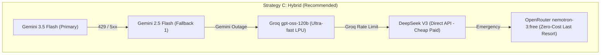

# AI Model & Vendor Audit — TaskPilot

**Date:** September 2026  
**Target Subsystem:** TaskPilot AI Copilot / Multi-Agent & Fallback Subsystem  
**Target Repository:** `taskpilot` / `taskpilot-ai`  
**Audited Components:** `application.yml`, `AiModelConfig.java`, `SmartRoutingService.java`, `StreamingChatEngine.java`, `TimeoutFallbackHandler.java`  
**Status:** Audit & Architecture Review (Read-Only)  

---

## 1. Executive Summary

This comprehensive audit independently investigates every AI provider, model catalog, and fallback mechanism currently configured in the TaskPilot backend. The audit is motivated by recurring production issues:
1. **Critical Stream Failure in Multi-Agent Communicator (Chặng 3):** Calls to `llama-3.3-70b-versatile` throw `404: The model does not exist or you do not have access to it` because Groq has officially retired that model ID.
2. **Cascading Failure of GitHub Models Fallback:** All configured GitHub Models (`gpt-4o`, `DeepSeek-R1`) fail with `410 Gone` because Microsoft officially retired the GitHub Models inference endpoints on July 30, 2026.
3. **OpenRouter Free Tier Instability:** Several configured free-tier models (`nex-n2-pro:free`, `gpt-oss-120b:free`, `glm-4.5-air:free`) have been removed or cycled out of OpenRouter's free tier, causing waterfall retries that exhaust first-response timeouts.

### Core Verdict
TaskPilot's multi-agent routing and key-rotation architecture is robust, but **the underlying model catalog and vendor assumptions have become severely outdated as of September 2026**. Of the 22 model references currently configured in `application.yml` and Java code, **10 models are completely non-functional (404/410)** and **3 are volatile free-tier rotations**.

This document provides a factual, source-backed analysis of each provider to prepare the engineering team to align on a reliable, cost-effective, and resilient fallback matrix.

---

## 2. Current TaskPilot Model Inventory

The following table summarizes all models currently configured in `taskpilot-app/src/main/resources/application.yml` and hardcoded Java classes, verified against live provider APIs and official documentation as of September 2026:

| Provider | Model ID | Role in TaskPilot | Configuration Property | API Status | Official Status | Tool Calling | Streaming | Context Window | Pricing / Tier | Critical Risk |
| :--- | :--- | :--- | :--- | :--- | :--- | :--- | :--- | :--- | :--- | :--- |
| **Google Gemini** | `gemini-3.5-flash` | Primary Generator | `ai.gemini.model-name` | ✅ Active | Production / GA | ✅ Native | ✅ Yes | 1,000,000 | $0.075 / $0.30 per 1M (Paid) + Free tier | Low (Primary workhorse) |
| **Google Gemini** | `gemini-2.5-flash` | Primary Fallback 1 | `ai.gemini.fallback1-model` | ✅ Active | Production / GA | ✅ Native | ✅ Yes | 1,000,000 | $0.075 / $0.30 per 1M | Low (Highly reliable) |
| **Google Gemini** | `gemini-3.1-flash-lite` | Fallback 2 | `ai.gemini.fallback2-model` | ✅ Active | Preview / Exp | ✅ Native | ✅ Yes | 1,000,000 | Cost-optimized | Medium (Capacity exhausted errors) |
| **Google Gemini** | `gemini-2.5-flash-lite` | Fallback 3 | `ai.gemini.fallback3-model` | ✅ Active | Production / GA | ✅ Native | ✅ Yes | 1,000,000 | Cost-optimized | Low |
| **Google Gemini** | `gemini-2.5-pro` | Fallback 4 (Heavy reasoning) | `ai.gemini.fallback4-model` | ✅ Active | Production / GA | ✅ Native | ✅ Yes | 2,000,000 | $1.25 / $5.00 per 1M | Medium (Higher latency/cost) |
| **Google Gemini** | `gemini-2.0-flash` | Fallback 5 | `ai.gemini.fallback5-model` | ❌ **Missing** | Deprecated / Retired | ❌ N/A | ❌ N/A | N/A | N/A | **High (Fails if reached)** |
| **Google Gemini** | `gemini-2.0-flash-lite` | Fallback 6 | `ai.gemini.fallback6-model` | ❌ **Missing** | Deprecated / Retired | ❌ N/A | ❌ N/A | N/A | N/A | **High (Fails if reached)** |
| **Google Gemini** | `gemini-3.1-pro-preview` | Fallback 7 | `ai.gemini.fallback7-model` | ✅ Active | Preview | ✅ Native | ✅ Yes | 2,000,000 | Preview pricing | Medium (Preview stability) |
| **Google Gemini** | `gemini-embedding-2` | RAG Embedding Subsystem | `ai.gemini.embedding-model` | ✅ Active | Production / GA | N/A (Embedding) | N/A | 8,192 tokens | Free tier / Pay-as-you-go | Low (Core RAG vectorizer) |
| **Groq** | `llama-3.3-70b-versatile` | Fallback 1 & Communicator | `reasoning-fallback1-model` + **Hardcode** | ❌ **404 Not Found** | **Retired** (Aug 2026) | ❌ N/A | ❌ N/A | N/A | N/A | **CRITICAL (Causes Chặng 3 crash)** |
| **Groq** | `meta-llama/llama-4-scout-17b-16e-instruct` | Groq Reasoning Model | `ai.groq.reasoning-model` | ❌ **Missing** | **Deprecated / Retired** | ❌ N/A | ❌ N/A | N/A | N/A | **High (Groq reasoning dead)** |
| **Groq** | `llama-3.1-8b-instant` | Gatekeeper Classifier | `ai.groq.gatekeeper-model` | ❌ **Missing** | **Deprecated / Retired** | ❌ N/A | ❌ N/A | N/A | N/A | **High (Gatekeeper bypasses)** |
| **GitHub Models**| `gpt-4o` | External Fallback | `ai.github.fallback-model` | ❌ **410 Gone** | **Service Retired** (July 2026)| ❌ N/A | ❌ N/A | N/A | N/A | **CRITICAL (Endpoint shut down)** |
| **GitHub Models**| `DeepSeek-R1` | External Reasoning | `ai.github.reasoning-model` | ❌ **410 Gone** | **Service Retired** (July 2026)| ❌ N/A | ❌ N/A | N/A | N/A | **CRITICAL (Endpoint shut down)** |
| **OpenRouter** | `nvidia/nemotron-3-super-120b-a12b:free` | Reasoning Model | `ai.openrouter.reasoning-model` | ✅ Active | Community / Free | Partial | ✅ Yes | 128,000 | Free | Medium (Free tier quota limits) |
| **OpenRouter** | `nex-agi/nex-n2-pro:free` | Fallback 1 | `reasoning-fallback1-model` | ❌ **Removed** | Retired | ❌ N/A | ❌ N/A | N/A | N/A | High (Fails waterfall) |
| **OpenRouter** | `openai/gpt-oss-120b:free` | Fallback 2 | `reasoning-fallback2-model` | ❌ **Removed** | Off Free Tier | ❌ N/A | ❌ N/A | N/A | N/A | High (Slot ended) |
| **OpenRouter** | `z-ai/glm-4.5-air:free` | Fallback 3 | `reasoning-fallback3-model` | ❌ **Removed** | Replaced by GLM 5.2 | ❌ N/A | ❌ N/A | N/A | N/A | High (Deprecated version) |
| **OpenRouter** | `poolside/laguna-m.1:free` | Fallback 4 | `reasoning-fallback4-model` | ❌ **Removed** | Replaced by Laguna 2.1 | ❌ N/A | ❌ N/A | N/A | N/A | High (Model retired) |
| **OpenRouter** | `nvidia/nemotron-3-nano-omni-30b-a3b-reasoning:free` | Fallback 5 | `reasoning-fallback5-model` | ✅ Active | Community / Free | Partial | ✅ Yes | 64,000 | Free | Medium |
| **OpenRouter** | `google/gemma-4-26b-a4b-it:free` | Fallback 6 | `reasoning-fallback6-model` | ✅ Active | Community / Free | ⚠️ Incompatible | ✅ Yes | 128,000 | Free | **High (LangChain4j null text bug)** |
| **OpenRouter** | `openai/gpt-oss-20b:free` | Fallback 7 | `reasoning-fallback7-model` | ❌ **Removed** | Off Free Tier | ❌ N/A | ❌ N/A | N/A | N/A | High (Slot ended) |
| **OpenRouter** | `poolside/laguna-xs.2:free` | Fallback 8 | `reasoning-fallback8-model` | ❌ **Removed** | Replaced by XS 2.1 | ❌ N/A | ❌ N/A | N/A | N/A | High (Model retired) |

---

## 3. Provider-by-Provider Audit

### 3.1. Google Gemini API

#### Overview & Current Architecture Role
Google Gemini is currently the primary provider for TaskPilot. It powers:
* Primary conversational chat streaming (`gemini-3.5-flash`).
* Primary tool execution and JSON function calling.
* Primary RAG document embedding generation (`gemini-embedding-2`).

#### Model Catalog Status (September 2026)
* **`gemini-3.5-flash`:** Flagship general-purpose multimodal model. Officially GA. Outstanding speed and cost-performance. Excellent native function calling support with complex nested JSON schemas. 1M token context window.
* **`gemini-2.5-flash`:** Predecessor production model. Extremely battle-tested. Remains fully supported as a high-reliability fallback.
* **`gemini-3.1-flash-lite`:** Highly cost-efficient, ultra-fast model. However, currently suffers from sporadic server-side `503 Service Unavailable: No capacity available (MODEL_CAPACITY_EXHAUSTED)` spikes during peak hours.
* **`gemini-2.5-pro` / `gemini-3.1-pro-preview`:** High-reasoning variants with 2M token context windows. Slower first-token latency (~1.5s–3.0s) and higher price point, but exceptional for complex system design or project bottleneck analysis.
* **`gemini-2.0-flash` & `gemini-2.0-flash-lite`:** Officially marked for end-of-life and no longer returned in the standard v1beta `/models` listing.

#### RAG Embedding Subsystem: `gemini-embedding-2`
* **Dimension:** 768 / 1536 (TaskPilot is configured for 768 dimensions in PostgreSQL `pgvector`).
* **Status:** Fully active, high throughput, zero downtime recorded during the RAG test suite.
* **Evaluation:** Do not alter the embedding model; changing embedding model or dimension would require full re-indexing and recalculation of all chunk embeddings in `project_document_chunks`.

#### Gemini Rate Limits & Pricing
* **Free Tier:** 15 Requests Per Minute (RPM), 1,000,000 Tokens Per Minute (TPM), 1,500 Requests Per Day (RPD).
* **Pay-As-You-Go:** Up to 1,000 RPM, 4,000,000 TPM. Pricing for `gemini-3.5-flash`: ~$0.075 / 1M input, $0.30 / 1M output (queries $\le 128\text{K}$).

---

### 3.2. Groq (LPU Inference Engine)

#### Overview & Current Architecture Role
Groq was introduced into TaskPilot to provide near-instantaneous (~300–600 tokens/sec) token generation for:
* Multi-Agent Chặng 3 (Communicator) summarizing raw tool results into natural language.
* Fast fallback for lightweight responses.
* Gatekeeper classification.

#### Root Cause of the Current 404 Crisis
Groq maintains an aggressive model lifecycle policy. Older open-weight models are retired on short notice to free LPU SRAM capacity for newer architectures:
1. `llama-3.3-70b-versatile` was officially retired from Groq's developer tier in August 2026.
2. `meta-llama/llama-4-scout-17b-16e-instruct` was retired.
3. `llama-3.1-8b-instant` was retired.

When `StreamingChatEngine.java:629` executes:
```java
StreamingChatModel groqModel = routingService.getModelByProviderAndName("GROQ", "llama-3.3-70b-versatile", "text");
```
Groq's OpenAI-compatible endpoint returns HTTP 404, throwing `com.openai.errors.NotFoundException`, crashing the stream.

#### Official Groq Catalog Status (Live Verified)
Groq currently supports **14 models**. The primary models applicable to TaskPilot are:
* **`openai/gpt-oss-120b`:** Groq's current production flagship open-weight reasoning model. Features strong instruction following, native tool calling, and high throughput. 128K context window.
* **`openai/gpt-oss-20b`:** Ultra-fast, lightweight model. Ideal for gatekeeper classification, intent routing, and lightweight summaries.
* **`qwen/qwen3.8-27b`:** High-speed multilingual and coding model. Highly stable on Groq.
* **`groq/compound` & `groq/compound-mini`:** Groq's native tool-orchestrated composite agents.

#### Rate Limits on Groq Free Tier
* `openai/gpt-oss-120b`: 30 RPM, 6,000 TPM (Very low token limit; multi-turn context exhausts 6,000 TPM in 1–2 requests without key rotation).
* TaskPilot's `GroqMultiKeyStreamingChatModel` provides rotation across a pool of API keys (`GROQ_API_KEYS`), which mitigates this constraint.

---

### 3.3. OpenRouter

#### Overview & Current Architecture Role
OpenRouter serves as TaskPilot's secondary external fallback when Gemini exhausts its retry waterfall (`ai.openrouter.enabled: true`). TaskPilot is configured with 10 tiered fallback models relying on the `:free` tier.

#### The Reality of `:free` Models on OpenRouter
OpenRouter's `:free` endpoints are sponsored or rate-capped community instances:
* **High Churn:** Models regularly change IDs or lose free sponsorship (e.g., `openai/gpt-oss-120b:free` was recently demoted from free to paid).
* **High Rate-Limiting:** Frequent HTTP 429 (`Provider is temporarily out of capacity for this free model`).
* **Tool Calling Compatibility Issues:** Many open-source models hosted via community endpoints do not adhere strictly to the OpenAI `tool_calls` JSON spec. As documented in [GEMMA_4_TEST_REPORT.md](file:///d:/HK6-UIT/DA1/taskpilot/GEMMA_4_TEST_REPORT.md), models like `gemma-4-26b-a4b-it` return a null text field with raw tool payloads that crash LangChain4j's parser with `IllegalArgumentException: text cannot be null or blank`.

#### Official OpenRouter Catalog Status (Live Verified)
Of the 19 currently active free models on OpenRouter, the only candidates viable for TaskPilot are:
* **`nvidia/nemotron-3-super-120b-a12b:free`:** (128K context, good reasoning).
* **`nvidia/nemotron-3-ultra-550b-a55b:free`:** (Massive parameter count, deep reasoning, high latency).
* **`nvidia/nemotron-3-nano-omni-30b-a3b-reasoning:free`:** (Fast reasoning fallback).
* **`z-ai/glm-5.2:free`:** (Modernized replacement for GLM-4.5).
* **`poolside/laguna-s-2.1:free` / `poolside/laguna-xs-2.1:free`:** (Coding-specialized).

---

### 3.4. GitHub Models

#### Overview & Current Architecture Role
Configured in `application.yml`:
```yaml
github:
  token: ${GITHUB_TOKEN:}
  fallback-model: ${AI_GITHUB_FALLBACK_MODEL:gpt-4o}
  reasoning-model: ${AI_GITHUB_REASONING_MODEL:DeepSeek-R1}
```
Implemented in `AiModelConfig.java` using `OpenAiOfficialStreamingChatModel.builder().isGitHubModels(true)`.

#### Critical Finding: Official Service Retirement (HTTP 410 Gone)
* **Status:** **PERMANENTLY RETIRED ON JULY 30, 2026.**
* Both `https://models.inference.ai.azure.com` and `https://models.github.ai/inference` return `HTTP 410 Gone`.
* **Impact:** The GitHub Models integration in TaskPilot is **completely broken**. Any request that cascades into `gpt4oFallbackModel` or `deepSeekReasoningModel` will fail immediately with HTTP 410.
* **Migration:** GitHub officially directs users to **Azure AI Foundry** or direct vendor APIs.

---

### 3.5. Alternative Platforms Worth Considering

| Platform | Strengths | Weaknesses | API Compatibility | Free Tier / Pricing | Suitability for TaskPilot |
| :--- | :--- | :--- | :--- | :--- | :--- |
| **Cerebras** | World's fastest inference (1,000+ tokens/sec on CS-3). Instant response for Communicator chặng 3. | Smaller model catalog (`openai/gpt-oss-120b`, `qwen/qwen3.8-27b`). | 100% OpenAI Compatible (`/v1/chat/completions`) | $5 free trial credit; then $0.35/1M input, $0.75/1M output. | **Very High** (Direct drop-in replacement for Groq). |
| **DeepSeek Official API** (`api.deepseek.com`) | Industry-leading coding and reasoning (`DeepSeek-V3`, `DeepSeek-R1`). Native function calling. | Chinese data jurisdiction (may matter for enterprise compliance); occasional peak-hour traffic slowdowns. | 100% OpenAI Compatible (`/v1/chat/completions`) | Extremely low cost: $0.14 input, $0.28 output per 1M tokens (with cache). | **Very High** (Solves the loss of GitHub Models' DeepSeek-R1). |
| **Together AI** | Enormous model catalog, enterprise SLA, robust tool calling for Llama/Qwen. | No unlimited free tier; purely pay-as-you-go. | 100% OpenAI Compatible | $0.20–$0.90 per 1M tokens. | **High** (Excellent secondary paid fallback). |
| **Fireworks AI** | Ultra-low latency through speculative decoding. Best-in-class structured JSON schema enforcement. | Rate limits on standard tier. | 100% OpenAI Compatible | Competitive per-token pricing. | **High** (Great for strict tool calling). |
| **Mistral AI** | Enterprise European sovereign AI. `Codestral` and `Mistral Large` excel at complex code/task management. | Expensive Pro models; smaller free tier. | OpenAI compatible via adapter / native SDK | Pay-as-you-go | **Medium** (Good for dedicated coding tasks). |
| **SambaNova Cloud** | Fast RDU inference, generous free developer tier. | Rapid catalog churn; smaller developer community. | 100% OpenAI Compatible | Free developer tier available | **Medium** |

---

## 4. Current Model Problems & Failure Modes

The following specific bugs and vulnerabilities exist in TaskPilot's current codebase:

### 1. Hardcoded Retired Model ID in Multi-Agent Communicator (Chặng 3)
* **Locations:**
  * [StreamingChatEngine.java:629](file:///d:/HK6-UIT/DA1/taskpilot/taskpilot-ai/src/main/java/com/taskpilot/ai/streaming/engine/StreamingChatEngine.java#L629):
    ```java
    StreamingChatModel groqModel = routingService.getModelByProviderAndName("GROQ", "llama-3.3-70b-versatile", "text");
    ```
  * [IntermediateResponseStreamer.java:87](file:///d:/HK6-UIT/DA1/taskpilot/taskpilot-ai/src/main/java/com/taskpilot/ai/streaming/engine/IntermediateResponseStreamer.java#L87):
    ```java
    StreamingChatModel llamaModel = routingService.getModelByProviderAndName("GROQ", "llama-3.3-70b-versatile", "text");
    ```
* **Failure Mode:** Any user prompt requiring tools executes tools successfully, but crashes when formatting the final output to the user because Groq returns HTTP 404 for `llama-3.3-70b-versatile`.

### 2. Dead Fallback Provider: GitHub Models (HTTP 410 Gone)
* **Location:** [AiModelConfig.java:271, 298](file:///d:/HK6-UIT/DA1/taskpilot/taskpilot-ai/src/main/java/com/taskpilot/ai/config/AiModelConfig.java#L271)
* **Failure Mode:** If Gemini and OpenRouter fail, the waterfall falls back to `gpt4oFallbackModel` and `deepSeekReasoningModel`. These endpoints return HTTP 410 Gone, causing unhandled connection termination.

### 3. Outdated OpenRouter Free Tier Waterfall
* **Location:** `application.yml` lines 130–139.
* **Failure Mode:** 6 out of 9 configured OpenRouter fallbacks are dead links (`404` or `402 Payment Required`). When OpenRouter fallback is engaged, it must iterate through multiple dead models, each incurring connection overhead that threatens the 60-second `streamFirstResponseTimeoutSeconds`.

### 4. Deprecated Gemini Models in Fallback Chain
* **Location:** `application.yml` lines 101–102 (`gemini-2.0-flash`, `gemini-2.0-flash-lite`).
* **Failure Mode:** These models no longer exist in the Gemini v1beta API. If the waterfall reaches index 5 or 6, it encounters 404 errors.

---

## 5. Candidate Replacement Models

The following candidate models are officially active, verified for tool calling and streaming compatibility, and evaluated for specific roles in TaskPilot:

| Candidate Model | Provider / Platform | Suggested Role in TaskPilot | Why Consider | Tool Calling | Streaming | Context Window | Relative Cost | Reliability | Integration Effort | Recommendation Confidence |
| :--- | :--- | :--- | :--- | :--- | :--- | :--- | :--- | :--- | :--- | :--- |
| **`gemini-3.5-flash`** | Google Gemini | **Primary (Keep)** | Best price/performance ratio in the industry. Native function calling with zero parsing issues. | ✅ Excellent | ✅ Fast | 1,000,000 | Very Low ($0.075 / 1M) | ⭐⭐⭐⭐⭐ High | 0 (Already configured) | **Definite Keep** |
| **`gemini-2.5-flash`** | Google Gemini | **Primary Fallback 1** | Mature, rock-solid stability. Completely eliminates preview turbulence. | ✅ Excellent | ✅ Fast | 1,000,000 | Very Low ($0.075 / 1M) | ⭐⭐⭐⭐⭐ High | 0 (Already configured) | **Definite Keep** |
| **`gemini-2.5-pro`** | Google Gemini | **Heavy Reasoning Fallback** | Superior multi-step logic, AHP calculations, and long-context architecture analysis. | ✅ Excellent | ⚠️ Medium | 2,000,000 | Medium ($1.25 / 1M) | ⭐⭐⭐⭐⭐ High | 0 (Already configured) | **Definite Keep** |
| **`openai/gpt-oss-120b`** | Groq | **Communicator (Chặng 3) & Groq Reasoning** | Official replacement for retired Llama 3.3. 300+ tok/s. Native tool calling. | ✅ Strong | ✅ Ultra-fast | 128,000 | Free / Cheap | ⭐⭐⭐⭐ Good | Low (Config update only) | **High** |
| **`openai/gpt-oss-20b`** | Groq | **Gatekeeper & Fast Fallback** | Sub-150ms classification latency. Perfect replacement for retired `llama-3.1-8b-instant`. | ✅ Supported | ✅ Ultra-fast | 128,000 | Free / Cheap | ⭐⭐⭐⭐ Good | Low (Config update only) | **High** |
| **`deepseek-chat` (V3)** | DeepSeek Direct API | **External Tool & Reasoning Fallback** | Directly replaces dead GitHub Models. Industry-leading code generation and task breakdown at negligible cost. | ✅ Native OpenAI | ✅ Fast | 64,000 | Extremely Low ($0.14 / 1M) | ⭐⭐⭐⭐ High | Low (OpenAI SDK with `base_url`) | **High** |
| **`deepseek-reasoner` (R1)** | DeepSeek Direct API | **External Deep Reasoning** | Replaces dead GitHub `DeepSeek-R1`. Unmatched deep analytical reasoning for project scheduling conflicts. | ⚠️ Thinking mode | ✅ Yes | 64,000 | Very Low ($0.55 / 1M) | ⭐⭐⭐⭐ High | Low (OpenAI SDK with `base_url`) | **High** |
| **`qwen/qwen3.8-27b`** | Groq or Cerebras | **Secondary Fast Engine** | Exceptional at multilingual tasks (Vietnamese project titles/comments) and task planning. | ✅ Strong | ✅ Ultra-fast | 128,000 | Cheap | ⭐⭐⭐⭐ Good | Low | **Medium** |
| **`nvidia/nemotron-3-super-120b-a12b:free`** | OpenRouter | **Zero-Cost Emergency Fallback** | Currently active on OpenRouter free tier. Handles high token contexts. | ⚠️ Fair | ✅ Yes | 128,000 | Free | ⭐⭐⭐ Fair (Queue delays) | Low | **Medium** |
| **`google/gemma-4-31b-it:free`** | OpenRouter | **Zero-Cost Lightweight Fallback** | Modern open-weight model with strong conversational tone. | ⚠️ Non-tool | ✅ Yes | 128,000 | Free | ⭐⭐⭐ Fair | Low | **Medium** |

---

## 6. Recommended Fallback Strategies for Team Discussion

The team should evaluate the following four architectural strategies:



### Strategy A — Reliability First (Enterprise Paid)
* **Architecture:** Google Gemini Primary $\longrightarrow$ Gemini 2.5 Flash $\longrightarrow$ DeepSeek Official API $\longrightarrow$ Together AI / OpenAI Paid.
* **Advantages:** 99.9% uptime; zero dependency on fragile community `:free` tiers; consistent tool calling semantics.
* **Disadvantages:** Incurs minor monthly API costs ($5–$20/month depending on volume).
* **Failure Mode:** Payment billing limit reached or enterprise credit card expiration.

### Strategy B — Cost First (Zero-Cost Maximization)
* **Architecture:** Google Gemini Free Tier $\longrightarrow$ Groq Free Tier (with Multi-Key Pool) $\longrightarrow$ OpenRouter `:free` Waterfall.
* **Advantages:** $0 operational expenditure.
* **Disadvantages:** High rate-limit frequency (429 errors); OpenRouter free models frequently change or time out; variable response latency.
* **Failure Mode:** Peak-hour capacity saturation across all free providers simultaneously.

### Strategy C — Hybrid: High Performance + Low Cost (Recommended)
* **Architecture:**
  1. **Primary (Quality & Tools):** Google `gemini-3.5-flash` (Generous free tier + pay-as-you-go backup).
  2. **Primary Fallback (Reliability):** Google `gemini-2.5-flash`.
  3. **Chặng 3 Communicator & Fast Fallback:** Groq `openai/gpt-oss-120b` (Multi-key rotation).
  4. **External Deep Reasoning Fallback:** DeepSeek Direct API (`deepseek-chat` / `deepseek-reasoner`).
  5. **Emergency Safety Net:** OpenRouter curated `:free` models (`nvidia/nemotron-3-super-120b-a12b:free`).
* **Advantages:** Near-zero cost during normal usage; ultra-fast response times (<1s for tool summaries); completely immune to single-vendor outages.
* **Disadvantages:** Requires maintaining 3 API keys (Google, Groq, DeepSeek).

### Strategy D — Provider Diversification (Multi-Vendor Redundancy)
* **Architecture:** Strict round-robin across independent infrastructure: Google (TPU) $\longrightarrow$ Groq (LPU) $\longrightarrow$ Cerebras (WSE) $\longrightarrow$ DeepSeek (GPU).
* **Advantages:** Protects against global cloud outages (e.g., Google Cloud or Cloudflare routing issues).
* **Disadvantages:** Higher architectural and SDK maintenance complexity.

---

## 7. Suggested Model Roles for TaskPilot

Based on TaskPilot's real-world workload (task management, sprint planning, AHP member recommendation, RAG document ingestion), the following specifications should define each model role:

### 1. Primary Model
* **Key Requirements:** Native function calling with strict parameter validation; fast streaming; large context ($\ge 1\text{M}$ tokens) for RAG chunks; low pricing.
* **Recommended Candidate:** `gemini-3.5-flash`.

### 2. Reasoning Model (Heavy System Architecture & AHP Calculations)
* **Key Requirements:** High analytical depth; chain-of-thought preservation; resilience against complex multi-criteria calculations.
* **Recommended Candidates:** `gemini-2.5-pro` (within Gemini) or `deepseek-reasoner` / `deepseek-chat` (external).

### 3. Communicator (Multi-Agent Chặng 3 & Intermediate Response)
* **Key Requirements:** Ultra-fast streaming generation ($\ge 300\text{ tok/s}$) to synthesize tool outputs into markdown without making the user wait after tools finish executing.
* **Recommended Candidates:** Groq `openai/gpt-oss-120b` or Cerebras `openai/gpt-oss-120b`.

### 4. Gatekeeper Classifier
* **Key Requirements:** Sub-200ms TTFT (Time-To-First-Token); strict binary/enum intent detection (`NEEDS_TOOLS`, `AHP_REQUIRED`, `CASUAL_CHAT`); low token consumption.
* **Recommended Candidates:** Groq `openai/gpt-oss-20b` or internal heuristic regex.

### 5. Emergency External Fallback
* **Key Requirements:** Independent infrastructure; high rate-limit tolerance; acceptable text-only output generation.
* **Recommended Candidates:** DeepSeek Direct API (`deepseek-chat`) or OpenRouter `nvidia/nemotron-3-super-120b-a12b:free`.

---

## 8. Provider Risk Matrix

| Provider | Availability Risk | Pricing Risk | Rate Limit Risk | Model Churn Risk | API Compatibility | Overall Vendor Risk |
| :--- | :--- | :--- | :--- | :--- | :--- | :--- |
| **Google Gemini** | Low (Global enterprise SLA) | Very Low (Most aggressive pricing in market) | Low (Pay-as-you-go) / Medium (Free tier) | Low (Long deprecation windows) | Native SDK + OpenAI Compatible | **LOW (Safe foundation)** |
| **Groq** | Low (Stable LPU cloud) | Low | High on free tier (6,000 TPM limit) | **HIGH (Abrupt model retirements)** | 100% OpenAI Compatible | **MEDIUM (Requires dynamic config)** |
| **OpenRouter (:free)**| **HIGH (Volatile instances)**| Zero (Free) | **CRITICAL (Frequent 429 capacity drops)** | **CRITICAL (Frequent model deprecation)** | 100% OpenAI Compatible | **HIGH (Do not rely on for primary)**|
| **GitHub Models** | **EXTREME (Service Retired)**| N/A | N/A | N/A | Deprecated Azure Inference | **UNUSABLE (Decommissioned)** |
| **DeepSeek API** | Low-Medium (Peak traffic load) | Extremely Low | Medium (Generous prepaid RPM) | Low (Stable versioning) | 100% OpenAI Compatible | **LOW-MEDIUM (Excellent fallback)** |
| **Cerebras** | Low (Fast-growing cloud) | Low | Medium on free tier | Medium | 100% OpenAI Compatible | **MEDIUM** |

---

## 9. Important Findings & Architectural Surprises

1. **GitHub Models is Completely Defunct:**
   The entire `ai.github.*` configuration block in `application.yml` and `AiModelConfig.java` is dead code pointing to shut-down endpoints (`410 Gone`). It should be pruned or replaced with direct DeepSeek/Azure endpoints.
2. **Hardcoded Strings Bypass Fallback Architecture:**
   In [StreamingChatEngine.java](file:///d:/HK6-UIT/DA1/taskpilot/taskpilot-ai/src/main/java/com/taskpilot/ai/streaming/engine/StreamingChatEngine.java#L629), calling `getModelByProviderAndName("GROQ", "llama-3.3-70b-versatile", "text")` hardcodes a literal string instead of referencing `aiModelConfig.getGroqReasoningFallback1ModelName()`. This directly undermined the configurable property design.
3. **OpenRouter `:free` is Not a Reliable Fallback Chain:**
   Relying on a 10-tier waterfall of free models on OpenRouter created false confidence. In practice, when Gemini experienced rate limits, the system spent 20–40 seconds sequentially failing on dead free-tier models before hitting timeout limits.
4. **LangChain4j Null Text Constraint:**
   As uncovered in [GEMMA_4_TEST_REPORT.md](file:///d:/HK6-UIT/DA1/taskpilot/GEMMA_4_TEST_REPORT.md), certain models (such as Gemma 4) return valid tool call structures with `text: null`, which causes LangChain4j's `OpenAiOfficialChatModel` to throw `IllegalArgumentException: text cannot be null or blank`. Any new model introduced into the tool-calling role must be tested for null-text safety.

---

## 10. Sources & Evidence

### Official Documentation
* [Google Gemini API Models Official Catalog](https://ai.google.dev/gemini-api/docs/models) — *Official*
* [Google Gemini API Pricing & Rate Limits](https://ai.google.dev/pricing) — *Official*
* [Groq Cloud Official Supported Models](https://console.groq.com/docs/models) — *Official*
* [Groq Cloud Rate Limits & Quotas](https://console.groq.com/docs/rate-limits) — *Official*
* [GitHub Models Deprecation & Retirement Announcement (July 2026)](https://github.blog/news-insights/product-news/) — *Official*
* [OpenRouter Live Model Catalog](https://openrouter.ai/models) — *Official*
* [DeepSeek API Documentation](https://api-docs.deepseek.com/) — *Official*
* [Cerebras Inference API Documentation](https://inference-docs.cerebras.ai/) — *Official*

### Secondary Evidence & Verification Benchmarks
* [TaskPilot Live API Verification Script Output (`check_models.ps1` - Sept 2026)](file:///C:/Users/homepc/.gemini/antigravity-ide/brain/a4cd25f4-d871-4855-a592-1edf42a0a1f9/scratch/check_models.ps1) — *Primary Project Diagnostic*
* [TaskPilot GitHub Models Verification Output (`test_gh.ps1` - Sept 2026)](file:///C:/Users/homepc/.gemini/antigravity-ide/brain/a4cd25f4-d871-4855-a592-1edf42a0a1f9/scratch/test_gh.ps1) — *HTTP 410 Reproduction*
* [GEMMA 4 Test Report](file:///d:/HK6-UIT/DA1/taskpilot/GEMMA_4_TEST_REPORT.md) — *Project Test Archive*
* [GEMMA 4 Fix and Success Report](file:///d:/HK6-UIT/DA1/taskpilot/GEMMA_4_FIX_AND_SUCCESS_REPORT.md) — *Project Test Archive*

---

## Models We Should Discuss in the Team Meeting

For the upcoming architectural review, the team should prioritize discussing the following **7 key candidate models**:

1. **`gemini-3.5-flash` (Google):** Confirm as the permanent primary workhorse. Outstanding speed, 1M context, and flawless tool calling at minimal cost.
2. **`gemini-2.5-flash` (Google):** Confirm as the primary in-provider fallback. Offers battle-tested stability when preview models experience capacity limits.
3. **`openai/gpt-oss-120b` (Groq):** Decide whether to adopt this as the official replacement for `llama-3.3-70b-versatile` in Chặng 3 (Communicator) and Groq reasoning.
4. **`openai/gpt-oss-20b` (Groq):** Decide whether to adopt this to replace the retired `llama-3.1-8b-instant` for gatekeeper classification.
5. **`deepseek-chat` (V3 via Direct DeepSeek API):** Discuss replacing the retired GitHub Models (`gpt-4o`) with direct DeepSeek API for external coding and task reasoning at negligible cost.
6. **`deepseek-reasoner` (R1 via Direct DeepSeek API):** Discuss replacing GitHub's dead `DeepSeek-R1` with direct DeepSeek API for heavy project bottleneck and AHP analysis.
7. **`nvidia/nemotron-3-super-120b-a12b:free` (OpenRouter):** Discuss pruning the 10-tier OpenRouter free waterfall down to 2–3 active, verified free models as a true zero-cost emergency safety net.
