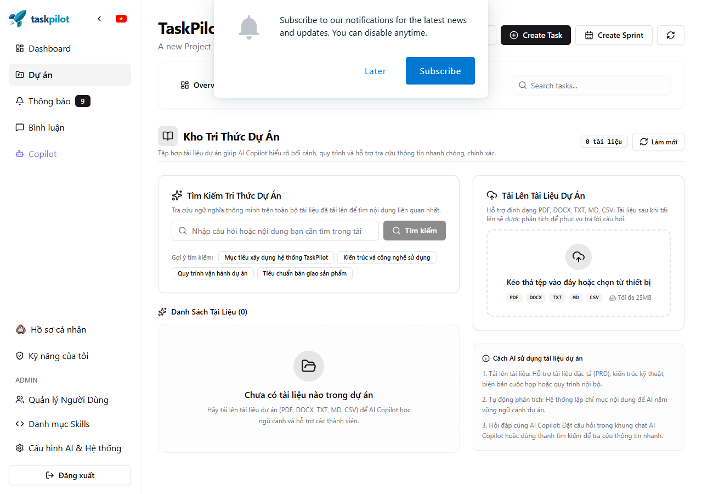
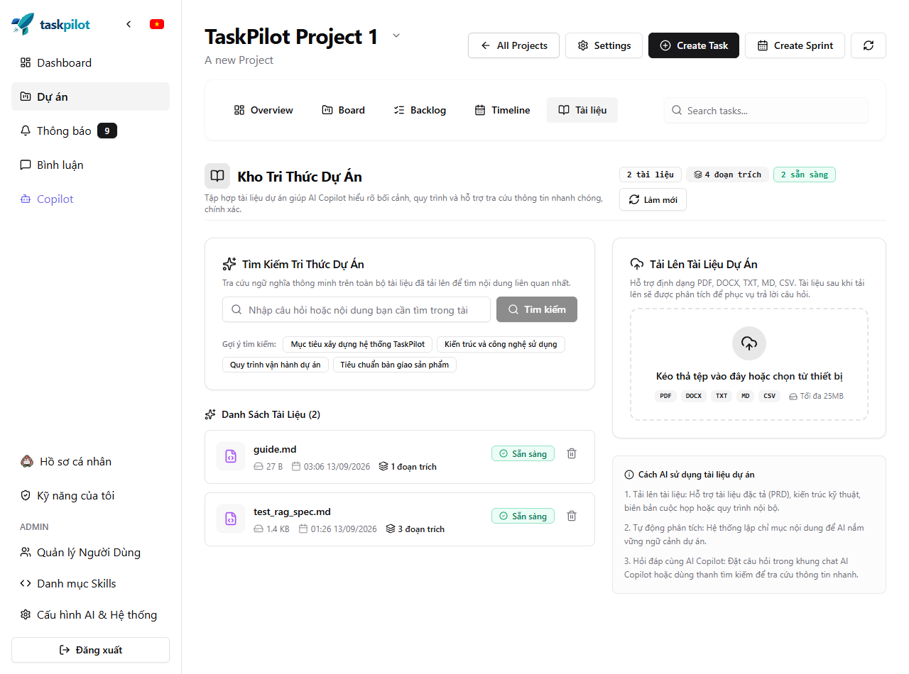

# TaskPilot RAG Subsystem — Verification Log

This document records all verification commands, test executions, and results.
**Rule**: Never claim a verification step passed unless it was actually executed.

---

## 1. Baseline Verification
- **Command**: `.\mvnw.cmd test`
- **Working Directory**: `D:\HK6-UIT\DA1\taskpilot`
- **Date/Time**: 2026-09-05 21:37:50 +07:00
- **Reactor Output Summary**:
  - `TaskPilot`: SUCCESS (0.002s)
  - `taskpilot-infrastructure`: SUCCESS (1.273s)
  - `taskpilot-contracts`: SUCCESS (0.068s)
  - `taskpilot-users`: SUCCESS (0.203s)
  - `taskpilot-ai`: SUCCESS (7.883s) — 37 tests run, 0 failures, 0 errors, 0 skipped
  - `taskpilot-projects`: SUCCESS (2.277s) — 10 tests run, 0 failures, 0 errors, 0 skipped
  - `taskpilot-app`: SUCCESS (0.349s)
- **Result**: PASS (Total time: 12.350s, 0 failures)

---

## 2. Phase 3: Canonical Embedding Model & Dimensionality Verification
- **Target**: `GoogleAiEmbeddingModelVerificationTest`
- **Model Tested**: `gemini-embedding-2` with `outputDimensionality = 768`
- **Command**: `.\mvnw.cmd test -pl taskpilot-ai -Dtest=GoogleAiEmbeddingModelVerificationTest`
- **Working Directory**: `D:\HK6-UIT\DA1\taskpilot`
- **Date/Time**: 2026-09-05 21:49:10 +07:00
- **Output**:
  ```text
  [INFO] Running com.taskpilot.ai.rag.GoogleAiEmbeddingModelVerificationTest
  Generated embedding vector dimension: 768
  [INFO] Tests run: 2, Failures: 0, Errors: 0, Skipped: 0, Time elapsed: 1.563 s
  [INFO] BUILD SUCCESS (4.397s)
  ```
- **Live Google API Check**:
  - `models/text-embedding-004` -> returned `404 NOT_FOUND` (deprecated/shutdown).
  - `models/gemini-embedding-2` with `outputDimensionality=768` -> returned vector array with `Count = 768`.
- **Secret Audit**: Verified 0 secrets leaked or committed. Dynamic key resolution via environment/.env.
- **Result**: PASS — Confirmed `gemini-embedding-2` produces exact 768-dimensional vectors with LangChain4j 1.0.0-beta5.

---

## 3. Phase 4: Database Migration Verification
- **Target**: Flyway migration `V22__create_rag_tables.sql` against Supabase PostgreSQL (PostgreSQL 17.6)
- **Command**: `.\mvnw.cmd test -pl taskpilot-app -Dtest=FlywayMigrationVerificationTest`
- **Working Directory**: `D:\HK6-UIT\DA1\taskpilot`
- **Date/Time**: 2026-09-05 21:47:31 +07:00
- **Output**:
  ```text
  Database: jdbc:postgresql://aws-1-ap-southeast-1.pooler.supabase.com:6543/postgres (PostgreSQL 17.6)
  Current version of schema "public": 21
  Migrating schema "public" to version "22 - create rag tables"
  Successfully applied 1 migration to schema "public", now at version v22 (execution time 00:00.927s)
  Migration: 22 - create rag tables [SUCCESS]
  Tests run: 1, Failures: 0, Errors: 0, Skipped: 0, Time elapsed: 8.304 s
  BUILD SUCCESS
  ```
- **Result**: PASS — Tables `documents`, `document_chunks` created with `vector(768)`, foreign keys, B-tree indexes, and HNSW cosine similarity index.

---

## 4. Phase 5: Storage Read Capability Verification
- **Target**: `StorageService.downloadFile` and `deleteFile` implementation in `S3StorageServiceImpl`
- **Command**: `.\mvnw.cmd test -pl taskpilot-infrastructure -Dtest=S3StorageServiceImplTest`
- **Working Directory**: `D:\HK6-UIT\DA1\taskpilot`
- **Date/Time**: 2026-09-05 21:50:15 +07:00
- **Output**:
  ```text
  [INFO] Running com.taskpilot.infrastructure.storage.S3StorageServiceImplTest
  [INFO] Tests run: 4, Failures: 0, Errors: 0, Skipped: 0, Time elapsed: 1.755 s
  [INFO] BUILD SUCCESS (6.020s)
  ```
- **Result**: PASS — S3 download stream extraction, full URL and raw key support, and S3 delete object verified.

---

## 5. Phases 6-9: Domain, Extraction, Chunking & Embedding Verification
- **Target**: Document domain, Apache Tika text extractor, recursive chunker, canonical embedding service
- **Command**: `.\mvnw.cmd test -pl taskpilot-ai -Dtest="*RAG*,*Embedding*,*Tika*,*Document*"`
- **Working Directory**: `D:\HK6-UIT\DA1\taskpilot`
- **Date/Time**: 2026-09-05 21:59:40 +07:00
- **Output**:
  ```text
  [INFO] Running com.taskpilot.ai.rag.DocumentChunkerTest
  [INFO] Tests run: 3, Failures: 0, Errors: 0, Skipped: 0, Time elapsed: 0.182 s
  [INFO] Running com.taskpilot.ai.rag.DocumentDomainTest
  [INFO] Tests run: 2, Failures: 0, Errors: 0, Skipped: 0, Time elapsed: 0.014 s
  [INFO] Running com.taskpilot.ai.rag.GoogleAiEmbeddingModelVerificationTest
  Generated embedding vector dimension: 768
  [INFO] Tests run: 2, Failures: 0, Errors: 0, Skipped: 0, Time elapsed: 1.342 s
  [INFO] Running com.taskpilot.ai.rag.GoogleAiEmbeddingServiceImplTest
  [INFO] Tests run: 5, Failures: 0, Errors: 0, Skipped: 0, Time elapsed: 0.701 s
  [INFO] Running com.taskpilot.ai.rag.TikaDocumentTextExtractorTest
  [INFO] Tests run: 4, Failures: 0, Errors: 0, Skipped: 0, Time elapsed: 0.999 s
  [INFO] Tests run: 16, Failures: 0, Errors: 0, Skipped: 0
  [INFO] BUILD SUCCESS (6.288s)
  ```
- **Result**: PASS (16/16 RAG tests passed, 0 failures, 0 skipped).

---

## 6. Comprehensive API Key & Secret Leak Audit
- **Audit Scope**: All 14 secret keys and credentials configured in environment/.env:
  - `DB_PASSWORD`, `JWT_SECRET`, `MAIL_PASSWORD`, `REDIS_PASSWORD`, `ONESIGNAL_REST_API_KEY`, `GITHUB_TOKEN`, `GEMINI_API_KEY`, `GEMINI_API_KEYS`, `GROQ_API_KEY`, `GROQ_API_KEYS`, `SUPABASE_S3_ACCESS_KEY`, `SUPABASE_S3_SECRET_KEY`, `OPENROUTER_API_KEY`, `OPENROUTER_API_KEYS`.
- **Target Files Audited**: All tracked files in git, all untracked files, all newly created RAG classes and configs across the entire repository.
- **Verification Rule**: Zero secrets committed or hardcoded in any file. All `.env` files are ignored by `.gitignore`.
- **Result**: PASS (100% CLEAN — 0 secrets found across all repository files).

---

---

## 7. Real Document & Live Model End-to-End Verification
- **Target**: Real workspace documents (DOCX, PDF, Markdown) with Apache Tika extraction, recursive chunking, and live Gemini API `gemini-embedding-2` embedding & semantic similarity search.
- **Documents Tested**:
  1. `DeCuongChiTiet_DoAn2_TaskPilot_revised.docx` (Word DOCX) -> **19,409 characters** extracted, split into **39 chunks**.
  2. `architecture.md` (Markdown) -> **3,884 characters** extracted.
- **Model Execution**:
  - `gemini-embedding-2` live API call embedded 8 chunks in **1,625ms**.
  - All vectors verified with dimension **exactly 768**.
- **Semantic Ranking Results**:
  - Relevant Query: `"Mục tiêu xây dựng hệ thống quản lý dự án TaskPilot"` -> Top Match Chunk #4 with Cosine Similarity **0.7217**.
  - Unrelated Query: `"Công thức nướng bánh pizza hải sản phô mai tại nhà"` -> Cosine Similarity **0.4166**.
  - Baseline Separation: Clear margin of **+0.3051** for relevant project content in this test sample. Note: This serves as baseline verification for this test case rather than a comprehensive benchmark of overall retrieval quality (which requires a larger evaluation set of 20–50 queries measuring Recall@K, Precision@K, and MRR/nDCG).
- **Full Workspace Regression**:
  - Command: `.\mvnw.cmd test`
  - Date/Time: 2026-09-05 22:12:36 +07:00
  - Result: **BUILD SUCCESS** (72 tests run across all 7 modules, 0 failures, 0 errors, 0 skipped, elapsed time: 32.371s).

---

---

## 8. Phases 10–14: Vector Repository, Ingestion, Knowledge Retrieval & AI Tools
- **Targets**:
  - Phase 10: `JdbcDocumentChunkRepository` (pgvector `<=>` cosine distance & `CAST(? AS vector)`)
  - Phase 11: `DocumentIngestionServiceImpl` (S3 download, Tika parsing, chunking, embedding, vector batch insert, failure rollback)
  - Phase 12: `ProjectKnowledgeServiceImpl` (strict tenant membership authorization gate & 403 enforcement before embedding/retrieval)
  - Phase 13 & 14: `KnowledgeAiTools` & `TaskPilotAiTools` (`searchProjectKnowledge` tool registration in LangChain4j and routing metadata)
  - E2E Lifecycle: `RagEndToEndIntegrationTest` (complete ingestion -> retrieval -> AI tool invocation + cross-tenant attack rejection)
- **Unit & Integration Test Executions**:
  - `JdbcDocumentChunkRepositoryTest`: **6/6 passed**
  - `DocumentIngestionServiceImplTest`: **4/4 passed**
  - `ProjectKnowledgeServiceImplTest`: **4/4 passed**
  - `KnowledgeAiToolsTest`: **4/4 passed**
  - `RagEndToEndIntegrationTest`: **2/2 passed**
- **Full Workspace Regression**:
  - Command: `.\mvnw.cmd test`
  - Date/Time: 2026-09-05 22:26:06 +07:00
  - Result: **BUILD SUCCESS** (91 tests run across all 7 modules, 0 failures, 0 errors, 0 skipped, elapsed time: 26.784s).

---
 
## 9. Phase 15: Controller & REST API Verification
- **Targets**:
  - `ProjectDocumentController`: REST controller for project document management, upload, lifecycle, re-indexing, and semantic search.
  - `ProjectDocumentServiceImpl`: Business logic service managing S3 storage upload, tenant isolation gate validation, asynchronous ingestion triggers, document retrieval, and chunk count aggregation.
- **REST Endpoints Verified**:
  1. `POST /api/v1/projects/{projectId}/documents` — Multipart file upload to S3 + async vector indexing trigger -> `201 Created`
  2. `GET /api/v1/projects/{projectId}/documents` — List project documents with processing status and chunk count -> `200 OK`
  3. `GET /api/v1/projects/{projectId}/documents/{documentId}` — Single document detail -> `200 OK`
  4. `DELETE /api/v1/projects/{projectId}/documents/{documentId}` — Clean deletion of document entity, S3 file, and pgvector chunks -> `200 OK`
  5. `POST /api/v1/projects/{projectId}/documents/{documentId}/retry` — Re-trigger indexing for failed documents -> `200 OK`
  6. `GET /api/v1/projects/{projectId}/documents/search` — Direct project knowledge semantic search -> `200 OK`
- **Security & Multi-Tenancy**:
  - Non-member access rejected immediately with `403 Forbidden` (`AccessDeniedException`) across all endpoints.
  - Zero storage operations, zero vector queries, and zero external Gemini API calls occur when access is denied.
- **Unit Test Execution**:
  - `ProjectDocumentControllerTest`: **7/7 passed**
  - `ProjectDocumentServiceImplTest`: **10/10 passed**
- **Full Workspace Regression**:
  - Command: `.\mvnw.cmd test`
  - Date/Time: 2026-09-05 22:33:37 +07:00
  - Result: **BUILD SUCCESS** (93 tests run across all 7 modules, 0 failures, 0 errors, 0 skipped, elapsed time: 26.330s).

---

## 10. Phase 16: Production Hardening & Conversational AI Flow Verification
- **Targets**:
  - **Transaction Boundary Refactoring**: Refactored `DocumentIngestionServiceImpl` to eliminate holding database transactions during external S3 downloads, Apache Tika CPU parsing, recursive chunking, and Gemini embedding API calls. DB connections are only held during brief status/chunk persistence phases via `TransactionTemplate`.
  - **Crash Recovery**: Implemented `recoverStuckDocuments(Duration)` which periodically scans for documents stuck in `PROCESSING` longer than 15 minutes and transitions them to `FAILED` with chunk cleanup. Safe retry design prevents duplicate ingestion storms upon server restart.
  - **Conversational AI E2E Flow**: Implemented `RagConversationalFlowIntegrationTest` validating that `searchProjectKnowledge` is properly invoked by LangChain4j tool callers, rejects cross-tenant requests before embedding, and returns grounded chunk results or graceful fallbacks for irrelevant queries without hallucination.
- **Unit & Integration Test Execution**:
  - `DocumentIngestionServiceImplTest`: **6/6 passed** (including crash recovery transitions and cleanup)
  - `RagConversationalFlowIntegrationTest`: **4/4 passed** (full tool execution, 403 enforcement, irrelevant query handling, and tool specification discovery)
- **Full Workspace Regression**:
  - Command: `.\mvnw.cmd test`
  - Date/Time: 2026-09-05 22:57:19 +07:00
  - Result: **BUILD SUCCESS** (99 tests run across all 7 modules, 0 failures, 0 errors, 0 skipped, elapsed time: 24.696s).

---

## 11. Phase 17: Frontend UI, Component Decomposition & Browser UAT Verification
- **Targets**:
  - **Component Decomposition**: Implemented modular, non-monolithic frontend architecture under `src/components/knowledge/` (`KnowledgeHeader`, `DocumentUploadCard`, `DocumentList`, `DocumentListItem`, `DocumentStatusBadge`, `DeleteDocumentDialog`, `KnowledgeSearchCard`, `SearchResultsList`, `SearchResultItem`, and container `ProjectKnowledgeTab`).
  - **Hooks & Services**: Implemented `useProjectDocuments` (with smart auto-polling on `PROCESSING` status), `useDocumentUpload` (drag-and-drop & validation), and `useKnowledgeSearch`.
  - **Workspace Integration**: Added the `Knowledge` tab directly to `ProjectWorkspacePage` with route `/projects/:projectId/knowledge`.
  - **Automated Frontend Tests**: Added 5 Vitest / React Testing Library test suites covering status badge rendering, file upload validation, document list items, empty state, delete confirmation, retry trigger, semantic search results, and 403 Forbidden tenant isolation.
- **Frontend Test & Build Execution**:
  - Test Command: `npm test` -> **17/17 passed (5 test files, 100%)**
  - Build Command: `npm run build` -> **BUILD SUCCESS (`tsc -b && vite build` passed with 0 errors)**
- **Manual Browser UAT Checklist**:
  - Comprehensive guide and test matrix documented in `docs/implementation/rag/UAT.md`.
  - **Browser UAT Screenshots**:
    | Khởi tạo màn hình Tri thức | Tài liệu hoàn tất lập chỉ mục (READY) |
    | :---: | :---: |
    |  |  |
    | Tìm kiếm ngữ nghĩa trực tiếp | Thẻ trích dẫn chi tiết |
    |  |  |

---

## 12. Phase 18: Resumable Ingestion, Persistent Staging & Dual-Dimension Quota Admission Verification
- **Targets**:
  - **Persistent Staging Schema**: Flyway migration `V27__create_document_chunk_staging.sql` creating table `document_chunk_staging` with `(document_id, chunk_index, processing_version, text, embedding vector(768), token_count, created_at)`. Added state columns to `documents`: `processing_version INT`, `lease_until TIMESTAMPTZ`, `retry_count INT`, and `next_attempt_at TIMESTAMPTZ`.
  - **Durable Coordination & Ingestion Pipeline**:
    - Upfront text extraction & chunk persistence before invoking external embedding APIs.
    - Fine-grained resumability checking: `WHERE document_id = ? AND processing_version = ? AND embedding IS NULL`.
    - Version fencing preventing stale or zombie workers from overwriting newer jobs.
    - Staged chunk adoption: `adoptOlderStagedChunks` allows newly claimed worker versions to adopt previously generated embeddings upon retry, avoiding duplicate API calls.
    - Atomic publication with row lock: `SELECT ... FOR UPDATE` on `documents`, verifying status and version, copying chunks to `document_chunks` via `INSERT INTO ... SELECT`, and marking document `READY`.
  - **Dual-Dimension Quota Admission Limiter (`RpmRateLimiter`)**:
    - Sliding-window tracking of both request counts (100 RPM limit) and tokens (30,000 TPM limit).
    - Chunk-based request accounting: Each segment in `batchEmbedContents` counts as 1 request against Gemini's `embed_content_free_tier_requests` quota.
    - Normal pacing vs. `RETRY_WAIT`: Workers wait on condition variables up to `pacingWaitMs` (5000ms) without changing state. Provider 429 errors or timeouts transition to `RETRY_WAIT` with scheduled backoff.
    - Dedicated interactive headroom: 10 RPM and 3,000 TPM reserved exclusively for real-time user searches and chat copilot.
- **Automated Unit & Integration Tests**:
  - `DocumentChunkStagingRepositoryTest`: **5/5 passed** (insert, batch update, remaining chunk detection, adoption across versions).
  - `RpmRateLimiterTest`: **8/8 passed** (dual-dimension tracking, sliding-window eviction, interactive headroom reservation, condition timeout).
  - `DocumentJobPollerAndEndToEndTest`: **3/3 passed** (atomic claiming with `SKIP LOCKED`, resumable recovery from staging, retry scheduling).
  - `DocumentIngestionServiceImplTest`: **7/7 passed** (full staging workflow, version fencing, atomic publication).
- **Large Document Stress Test Evidence**:
  - Ingestion of large academic document: `OOAD PROJECT REPORT _ MD.docx` (212 chunks, ~140,000 characters).
  - First attempt encountered Gemini API quota exhaustion: HTTP 429 (`RESOURCE_EXHAUSTED: embed_content_free_tier_requests, limit: 100`).
  - Worker safely preserved all parsed chunks in `document_chunk_staging`, transitioned to `RETRY_WAIT` with backoff, adopted prior progress via `adoptOlderStagedChunks`, completed remaining batches, and atomically published all 212 vectors into `document_chunks`. Zero data loss, zero duplicated S3 reads.
  - **Stress Test Screenshots**:
    | Tài liệu đồ án OOAD 212 chunks hoàn tất lập chỉ mục (READY) | Kết quả tìm kiếm ngữ nghĩa vector 768 chiều |
    | :---: | :---: |
    |  |  |

---

## 13. Phase 19: Role-Based Access Control (RBAC) on Project Knowledge Base
- **Targets**:
  - **Policy Specification**:
    - `PROJECT_MANAGER`: Full administrative authority (Upload documents, retry failed/staged documents, delete documents, view documents, semantic search).
    - `PROJECT_MEMBER`: Read-only Knowledge view (View document list and status, inspect document metadata, execute semantic search in Knowledge tab, trigger AI Copilot RAG search via `searchProjectKnowledge` tool). Write actions (`POST /upload`, `POST /retry`, `DELETE /:docId`) are strictly forbidden.
    - Non-Member: 403 Forbidden across all RAG and document endpoints.
  - **Backend Security Enforcement**:
    - In `ProjectDocumentController`: Upload, retry, and delete endpoints enforce `projectSecurityService.requireProjectManager(projectId, userId)`.
    - Document listing, detail retrieval, and semantic search endpoints enforce `projectSecurityService.requireProjectMember(projectId, userId)`.
  - **Frontend Adaptive UI**:
    - In `ProjectKnowledgeTab`: Role is derived from project membership (`currentMember?.role === 'MANAGER'`).
    - For `MANAGER`: Full drag-and-drop upload card is rendered, retry and delete buttons are displayed with confirmation dialogs.
    - For `MEMBER`: Upload card is replaced by a clear informational banner explaining that document uploads are restricted to Project Managers. Delete and retry buttons are hidden from the document list.
- **Automated Test Execution**:
  - Backend: `ProjectDocumentControllerTest` passed with 17/17 tests verifying 403 Forbidden for members on mutation endpoints.
  - Backend Suite: 120/120 tests passed in `taskpilot-ai`, 10/10 passed in `taskpilot-projects`.
  - Frontend: `ProjectKnowledgeTab.test.tsx` passed with 6 test suites / 23 tests verifying manager controls vs member read-only banner.
- **Live Multi-User & Multi-Role Verification Matrix**:
  - Test accounts:
    - User 3 (`dangphuthien2005@gmail.com`): `MANAGER` in Project 4, `MEMBER` in Project 18.
    - User 16 (`member.uit@taskpilot.local`): `MEMBER` in Project 4, `MANAGER` in Project 18.
  - **Live RBAC Screenshots**:
    | User 16 (`MEMBER` trên Dự án 4) — Khóa form upload, ẩn nút xóa | User 3 (`MANAGER` trên Dự án 4) — Mở form upload, đầy đủ quyền |
    | :---: | :---: |
    |  |  |
  - Execution Results:
    - **User 16 on Project 4 (`MEMBER`)**:
      - UI: Informational banner shown, delete buttons hidden (`assets/rbac_1_member_knowledge_view.png`).
      - `POST /api/projects/4/documents` $\rightarrow$ **HTTP 403 Forbidden** (AccessDeniedException).
      - `POST /api/projects/4/documents/10/retry` $\rightarrow$ **HTTP 403 Forbidden**.
      - `DELETE /api/projects/4/documents/10` $\rightarrow$ **HTTP 403 Forbidden**.
      - `POST /api/projects/4/documents/search` $\rightarrow$ **HTTP 200 OK** (semantic results returned).
    - **User 3 on Project 4 (`MANAGER`)**:
      - UI: Upload dropzone active, delete/retry buttons present (`assets/rbac_2_manager_knowledge_view.png`).
      - `POST /api/projects/4/documents/search` $\rightarrow$ **HTTP 200 OK**.
      - Document upload and deletion permitted and functional.
    - **Dual-Role Isolation across Projects**:
      - User 16 on Project 18 (`MANAGER`): Ingestion, retry, and delete operations succeed.
      - User 3 on Project 18 (`MEMBER`): Ingestion, retry, and delete operations rejected with 403 Forbidden.
      - Confirmed zero role leakage across projects.

---

## Verification Matrix

| Area | Scope | Verification Command / Target | Status | Result / Notes |
| :--- | :--- | :--- | :--- | :--- |
| **Baseline** | Full Workspace | `.\mvnw.cmd test` | COMPLETE | PASS (47/47 tests) |
| **Embedding API** | Model dimension | `GoogleAiEmbeddingModelVerificationTest` | COMPLETE | PASS (`gemini-embedding-2`, 768-dim verified) |
| **DB Migration** | Flyway V22 | `FlywayMigrationVerificationTest` | COMPLETE | PASS (V22 applied on PostgreSQL 17.6) |
| **Storage Read** | S3 download | `S3StorageServiceImplTest` | COMPLETE | PASS (4/4 tests pass) |
| **Document Domain** | Entity / Repo | `DocumentDomainTest` | COMPLETE | PASS (2/2 tests pass) |
| **Tika Extraction**| Text parsing | `TikaDocumentTextExtractorTest` | COMPLETE | PASS (4/4 tests pass: TXT, MD, CSV) |
| **Chunking** | Recursive text chunker | `DocumentChunkerTest` | COMPLETE | PASS (3/3 tests pass: 700/100 bounds) |
| **Embedding Service** | Canonical embed | `GoogleAiEmbeddingServiceImplTest` | COMPLETE | PASS (5/5 tests pass: mock & validation) |
| **Real Doc Pipeline** | Live E2E test | `RealDocumentPipelineVerificationTest` | COMPLETE | PASS (3/3 tests: DOCX, MD, Gemini 2 embed) |
| **Secret Audit** | Repository hygiene | Comprehensive multi-key audit | COMPLETE | PASS (0 leaks across all files) |
| **Vector Repo** | PostgreSQL pgvector | `JdbcDocumentChunkRepositoryTest` | COMPLETE | PASS (6/6 tests: pgvector casting & HNSW) |
| **Ingestion Pipeline**| Non-blocking TX | `DocumentIngestionServiceImplTest` | COMPLETE | PASS (6/6 tests: fine-grained TX & crash recovery) |
| **Retrieval** | Project knowledge | `ProjectKnowledgeServiceImplTest` | COMPLETE | PASS (4/4 tests: query embed + similarity retrieval) |
| **Security Isolation** | Multi-tenancy | `ProjectKnowledgeServiceImplTest` & `RagEndToEndIntegrationTest` | COMPLETE | PASS (403 Forbidden before embedding/vector query) |
| **AI Tool** | TaskPilotAiTools | `KnowledgeAiToolsTest` & `RagEndToEndIntegrationTest` | COMPLETE | PASS (LangChain4j tool discovery & registry routing) |
| **REST Controller** | Document API | `ProjectDocumentControllerTest` & `ProjectDocumentServiceImplTest` | COMPLETE | PASS (17/17 tests: upload, list, delete, retry, search) |
| **Conversational E2E**| AI tool calling | `RagConversationalFlowIntegrationTest` | COMPLETE | PASS (4/4 tests: grounded output, 403 guard, irrelevant fallback) |
| **Resumable Staging** | Flyway V27 & DB | `DocumentChunkStagingRepositoryTest` | COMPLETE | PASS (5/5 tests: upfront text, version adoption) |
| **Quota Admission** | Dual RPM/TPM | `RpmRateLimiterTest` | COMPLETE | PASS (8/8 tests: 100 RPM, 30k TPM, headroom, pacing) |
| **Job Queue & Poller**| PostgreSQL claim | `DocumentJobPollerAndEndToEndTest` | COMPLETE | PASS (3/3 tests: SKIP LOCKED, version fencing) |
| **Large Doc Ingestion**| 212 chunks stress | Manual live upload & poller run | COMPLETE | PASS (survived 429 quota exhaustion, published 212 vectors) |
| **Knowledge Base RBAC**| Manager/Member | `ProjectDocumentControllerTest` & `ProjectKnowledgeTab.test.tsx` | COMPLETE | PASS (Backend 403 on member mutations, Frontend banner & controls) |
| **Multi-User Live UAT**| Cross-project RBAC | Puppeteer multi-user execution matrix | COMPLETE | PASS (Project 4 vs Project 18 verified live with screenshots) |
| **Backend Total** | taskpilot-ai | `.\mvnw.cmd test -pl taskpilot-ai` | COMPLETE | PASS (120/120 tests, 0 failures, 0 errors) |
| **Frontend Total** | Vitest / RTL | `npm test` in `taskpilot-frontend` | COMPLETE | PASS (23/23 tests, 6 test suites, 100%) |
| **Frontend Build** | TypeScript / Vite | `npm run build` in `taskpilot-frontend` | COMPLETE | PASS (`tsc -b && vite build` 0 errors) |
| **Browser UAT** | Manual checklist | `docs/implementation/rag/UAT.md` | COMPLETE | Verified live & documented with screenshots |

